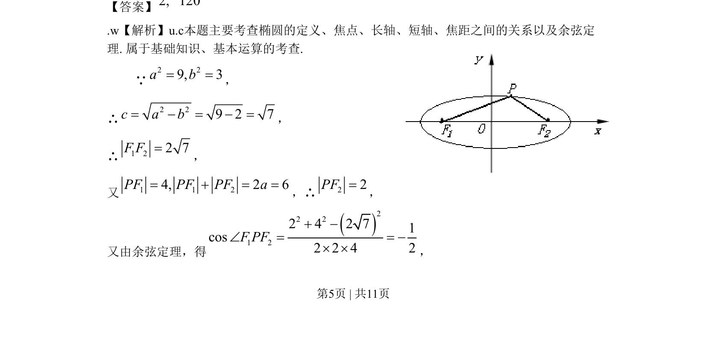
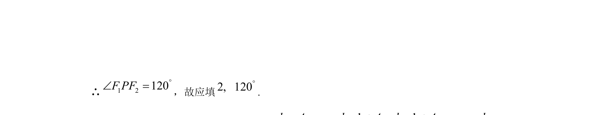

## 题面

## 摘要

本题结合椭圆定义与余弦定理，求椭圆上一点处的线段长与夹角。

## 关联考点

- [[1413-椭圆的定义|椭圆定义]]
- [[941-椭圆标准方程|椭圆标准方程]]
- [[126-定理|余弦定理]]
- [[037-焦点焦距|焦点]]

## 答案与解析

> 📄 原 PDF 第 5 页：`素材/真题/北京/2008-2024·（北京）数学高考真题/2009年高考数学试卷（文）（北京）（解析卷）.pdf`

<!-- 题干文本-start -->
## 题干文本
13．椭圆 的焦点为 ，点P在椭圆上，若 ，则        ；
的大小为        .
<!-- 题干文本-end -->

<!-- 解析文本-start -->
## 解析文本
【答案】
.w【解析】u.c本题主要考查椭圆的定义、焦点、长轴、短轴、焦距之间的关系以及余弦定
理. 属于基础知识、基本运算的考查.
         ∵ ，
∴ ，
∴ ，
又 ，∴ ，
又由余弦定理，得 ，
,x y2 0,4,5,x yxx+ - ³ìï£íï£îs x y= +4, 5x y= =4 5 9s x y= + = + =3 , 1,( ), 1,xxf xx xì£=í- >î( ) 2f x=x=3log 2x31log 23 2xxx£ìÞ =í=î12 2xx x>ìí- = Þ = -î3log 22 219 2x y+ =1 2,F F1| | 4PF=2| |PF=1 2F PFÐ2, 120°2 29, 3a b= =2 29 2 7c a b= - = - =1 22 7F F=1 1 24, 2 6PF PF PF a= + = =22PF=22 21 22 4 2 71cos2 2 4 2F PF+ -Ð = = -´ ´
<!-- 解析文本-end -->
