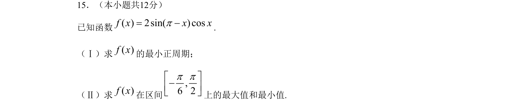
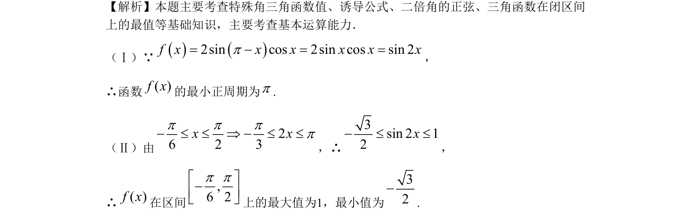

## 题面

## 摘要

本题考查三角恒等变换及正弦型函数的周期与最值，题干给出 f(x)=2sin(π-x)cosx，化简后为 sin2x，再求最小正周期和在给定区间上的最值。

## 关联考点

- [[253-特殊角三角函数值|特殊角三角函数值]]
- [[1249-三角函数的诱导公式|诱导公式]]
- [[二倍角的正弦]]
- [[三角函数在闭区间上的最值]]

## 答案与解析

> 📄 原 PDF 第 6 页：`素材/真题/北京/2008-2024·（北京）数学高考真题/2009年高考数学试卷（文）（北京）（解析卷）.pdf`
