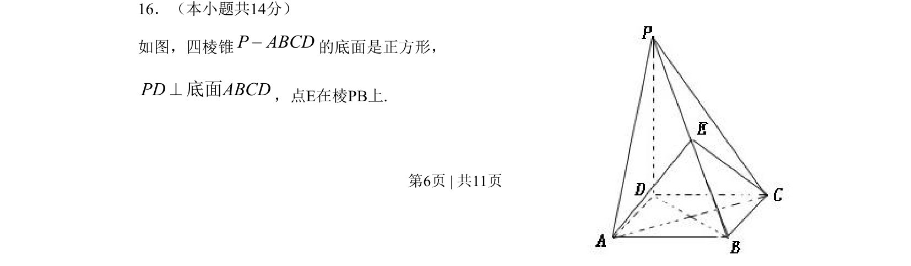
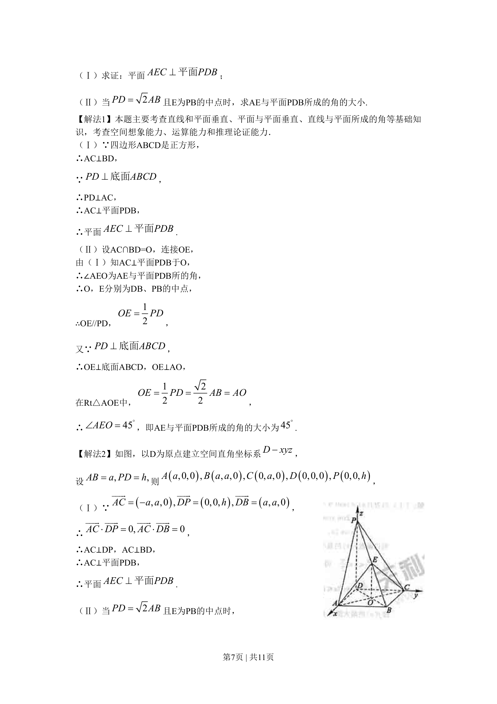
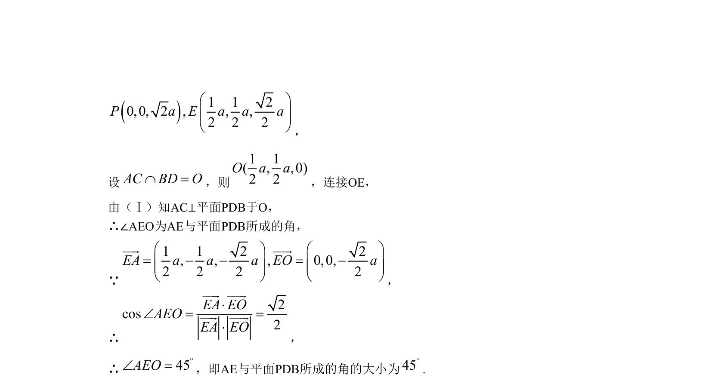

## 题面

## 摘要

四棱锥中，底面正方形且侧棱与底面垂直，考查线面关系及空间角的计算。

## 关联考点

- [[1086-线面垂直的判定与性质|线面垂直]]
- [[401-空间向量基本概念|空间向量]]
- [[353-空间角|二面角]]

## 答案与解析

> 📄 原 PDF 第 6 页：`素材/真题/北京/2008-2024·（北京）数学高考真题/2009年高考数学试卷（文）（北京）（解析卷）.pdf`
