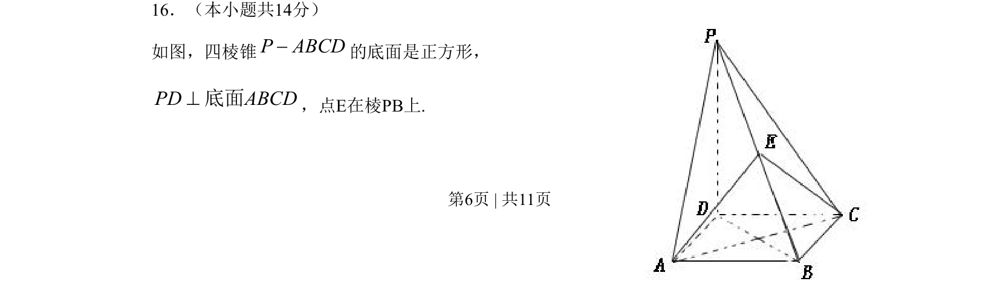
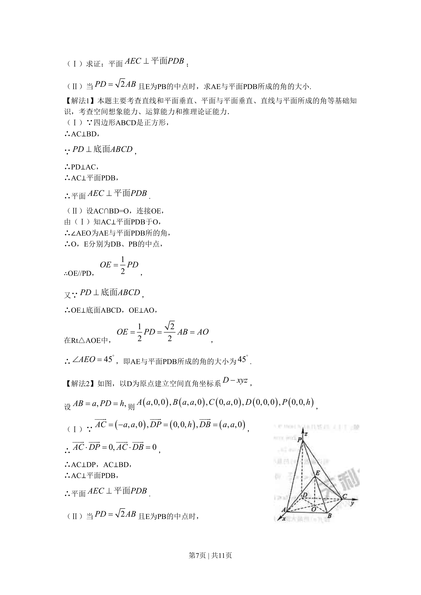
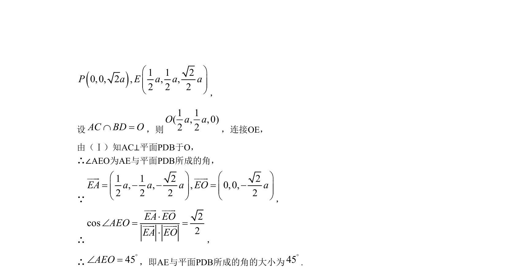

## 题面

## 摘要

四棱锥中，底面正方形且侧棱与底面垂直，考查线面关系及空间角的计算。

## 关联考点

- [[1086-线面垂直的判定与性质|线面垂直]]
- [[401-空间向量基本概念|空间向量]]
- [[353-空间角|二面角]]

## 答案与解析

> 📄 原 PDF 第 6 页：`素材/真题/北京/2008-2024·（北京）数学高考真题/2009年高考数学试卷（文）（北京）（解析卷）.pdf`

<!-- 题干文本-start -->
## 题干文本
16．（本小题共14分）
如图，四棱锥 的底面是正方形，
，点E在棱PB上.
1 2120F PF°Ð =2, 120°k AÎ1k A- Ï1k A+ Ïk{ 1, 2,3, 4,5,6,7,8,}S=kk1, 2,3 , 2,3, 4 , 3, 4,5 , 4,5,6 , 5,6,7 , 6,7,8( ) 2sin( ) cosf x x xp= -( )f x( )f x,6 2p pé ù-ê úë û2sin cos 2sin cos sin 2f x x x x x xp= - = =( )f xp26 2 3x xp p pp- £ £ Þ - £ £3sin 2 12x- £ £( )f x,6 2p pé ù-ê úë û32-P ABCD-PD ABCD^底面
<!-- 题干文本-end -->

<!-- 解析文本-start -->
## 解析文本

<!-- 解析文本-end -->
