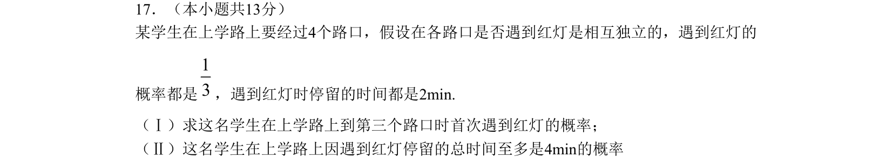
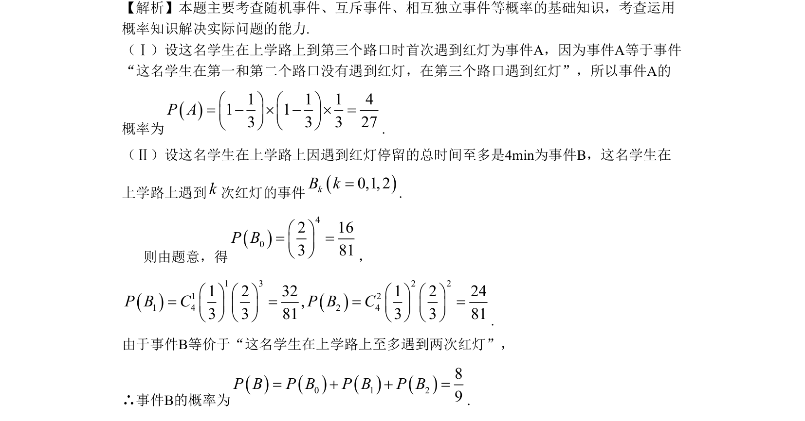

## 题面

## 摘要

本题主要考查独立事件与互斥事件的概率计算，涉及首次成功和至多两次红灯的模型，以路口遇红灯为实际背景。

## 关联考点

- [[317-事件的关系运算|独立事件]]
- [[317-事件的关系运算|互斥事件]]
- [[948-概率计算|概率计算]]
- [[469-二项分布|二项分布]]

## 答案与解析

> 📄 原 PDF 第 8 页：`素材/真题/北京/2008-2024·（北京）数学高考真题/2009年高考数学试卷（文）（北京）（解析卷）.pdf`
