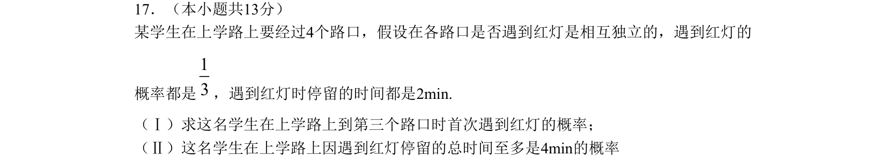
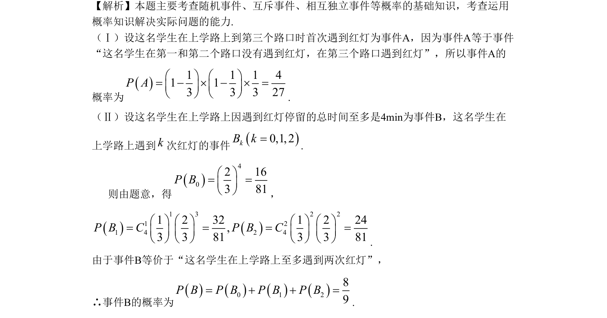

## 题面

## 摘要

本题主要考查独立事件与互斥事件的概率计算，涉及首次成功和至多两次红灯的模型，以路口遇红灯为实际背景。

## 关联考点

- [[317-事件的关系运算|独立事件]]
- [[317-事件的关系运算|互斥事件]]
- [[948-概率计算|概率计算]]
- [[469-二项分布|二项分布]]

## 答案与解析

> 📄 原 PDF 第 8 页：`素材/真题/北京/2008-2024·（北京）数学高考真题/2009年高考数学试卷（文）（北京）（解析卷）.pdf`

<!-- 题干文本-start -->
## 题干文本
17．（本小题共13分）
某学生在上学路上要经过4个路口，假设在各路口是否遇到红灯是相互独立的，遇到红灯的
概率都是 ，遇到红灯时停留的时间都是2min.
（Ⅰ）求这名学生在上学路上到第三个路口时首次遇到红灯的概率；
（Ⅱ）这名学生在上学路上因遇到红灯停留的总时间至多是4min的概率
<!-- 题干文本-end -->

<!-- 解析文本-start -->
## 解析文本
【解析】本题主要考查随机事件、互斥事件、相互独立事件等概率的基础知识，考查运用
概率知识解决实际问题的能力.
（Ⅰ）设这名学生在上学路上到第三个路口时首次遇到红灯为事件A，因为事件A等于事件
“这名学生在第一和第二个路口没有遇到红灯，在第三个路口遇到红灯”，所以事件A的
概率为.
（Ⅱ）设这名学生在上学路上因遇到红灯停留的总时间至多是4min为事件B，这名学生在
上学路上遇到 次红灯的事件.
      则由题意，得 ，
.
由于事件B等价于“这名学生在上学路上至多遇到两次红灯”，
∴事件B的概率为.
<!-- 解析文本-end -->
