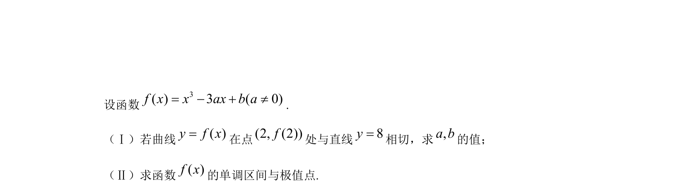
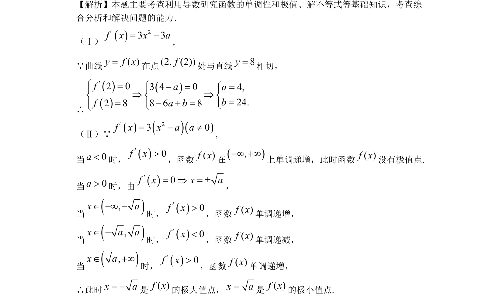

## 题面

## 摘要

（待补）

## 关联考点

## 答案与解析

> 📄 原 PDF 第 8 页：`素材/真题/北京/2008-2024·（北京）数学高考真题/2009年高考数学试卷（文）（北京）（解析卷）.pdf`

<!-- 题干文本-start -->
## 题干文本
18．（本小题共14分）
()1 1 20,0, 2 , , ,2 2 2P a E a a aæ öç ÷ç ÷è øAC BD OÇ =1 1( , ,0)2 2O a a1 1 2 2, , , 0,0,2 2 2 2EA a a a EO aæ ö æ ö= - - = -ç ÷ ç ÷ç ÷ ç ÷è ø è øuuu r uuu r2cos2EA EOAEOEA EO×Ð = =×uuu r uuu ruuu r uuu r45AEO°Ð =45°13()1 1 1 41 13 3 3 27P Aæ ö æ ö= - ´ - ´ =ç ÷ ç ÷è ø è øk()0,1, 2kB k=()402 163 81P Bæ ö= =ç ÷è ø()()1 3 2 21 21 4 2 41 2 32 1 2 24,3 3 81 3 3 81P B C P B Cæ ö æ ö æ ö æ ö= = = =ç ÷ ç ÷ ç ÷ ç ÷è ø è ø è ø è ø()()()()0 1 289P B P B P B P B= + + =
<!-- 题干文本-end -->

<!-- 解析文本-start -->
## 解析文本

<!-- 解析文本-end -->
