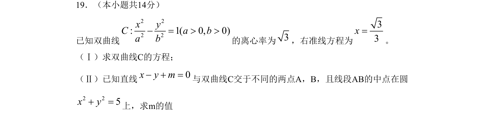
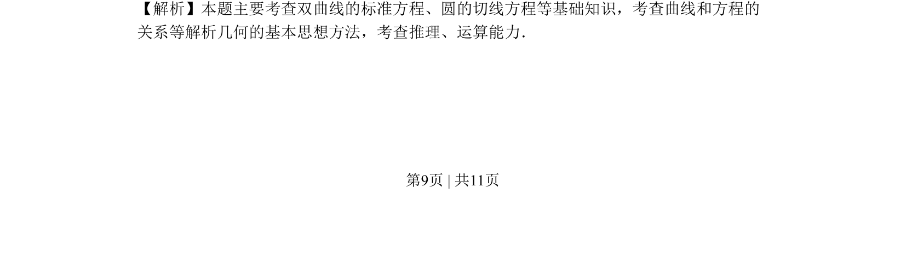
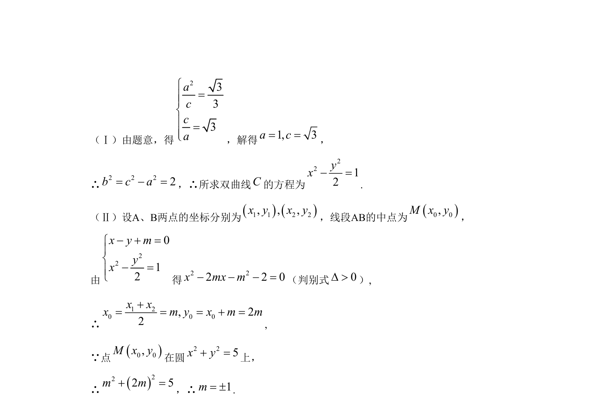

## 题面

## 摘要

求双曲线方程及直线与双曲线相交背景下，利用弦中点坐标求参数值。

## 关联考点

- [[732-双曲线的标准方程|双曲线的标准方程]]
- [[1001-直线与双曲线位置关系|直线与双曲线位置关系]]
- [[635-中点坐标公式|中点坐标公式]]
- [[782-圆的方程|圆的方程]]

## 答案与解析

> 📄 原 PDF 第 9 页：`素材/真题/北京/2008-2024·（北京）数学高考真题/2009年高考数学试卷（文）（北京）（解析卷）.pdf`
