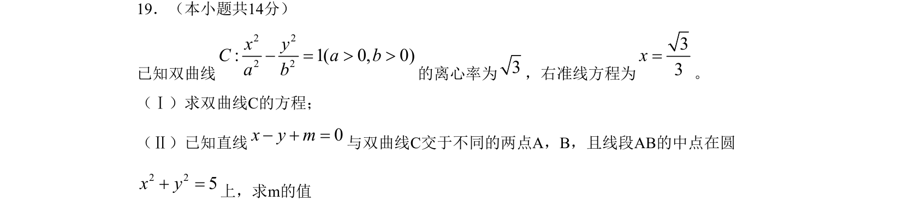
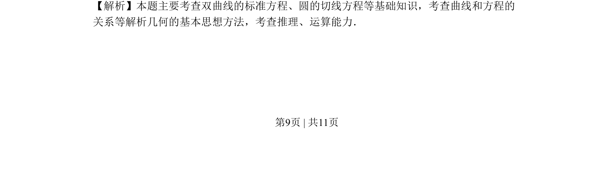
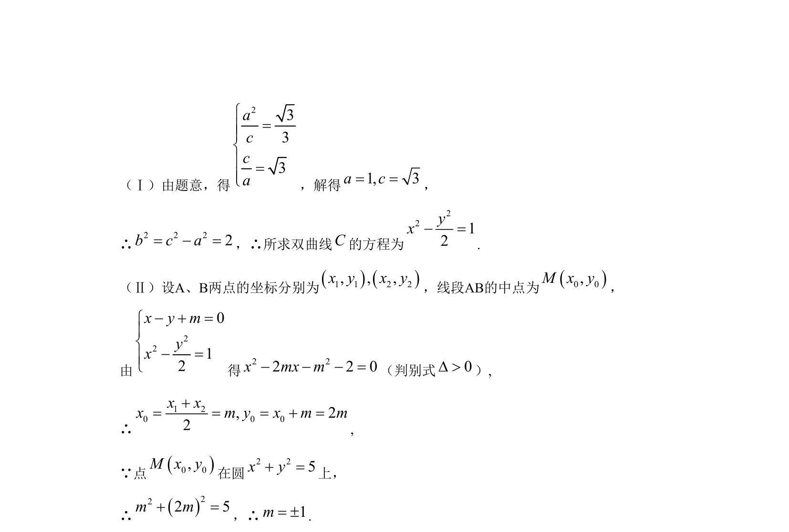

## 题面

## 摘要

求双曲线方程及直线与双曲线相交背景下，利用弦中点坐标求参数值。

## 关联考点

- [[732-双曲线的标准方程|双曲线的标准方程]]
- [[1001-直线与双曲线位置关系|直线与双曲线位置关系]]
- [[635-中点坐标公式|中点坐标公式]]
- [[782-圆的方程|圆的方程]]

## 答案与解析

> 📄 原 PDF 第 9 页：`素材/真题/北京/2008-2024·（北京）数学高考真题/2009年高考数学试卷（文）（北京）（解析卷）.pdf`

<!-- 题干文本-start -->
## 题干文本
19．（本小题共14分）
已知双曲线 的离心率为 ，右准线方程为 。
（Ⅰ）求双曲线C的方程；
（Ⅱ）已知直线 与双曲线C交于不同的两点A，B，且线段AB的中点在圆
上，求m的值
<!-- 题干文本-end -->

<!-- 解析文本-start -->
## 解析文本
【解析】本题主要考查双曲线的标准方程、圆的切线方程等基础知识，考查曲线和方程的
关系等解析几何的基本思想方法，考查推理、运算能力．
3( ) 3 ( 0)f x x ax b a= - + ¹( )y f x=(2, (2))f8y=,a b( )f x' 23 3f x x a= -( )y f x=(2, (2))f8y='2 03 4 04,24.8 6 82 8faaba bfì=- =ì=ìï ïÞ Þí í í=- + ==ïîïîî' 23 0f x x a a= - ¹0a<'0f x>( )f x,-¥ +¥( )f x0a>'0f x x a= Þ = ±,x aÎ -¥ -'0f x>( )f x,x a aÎ -'0f x<( )f x,x aÎ +¥'0f x>( )f xx a= -( )f xx a=( )f x2 22 2: 1( 0, 0)x yC a ba b- = > >333x=0x y m- + =2 25x y+ =
<!-- 解析文本-end -->
