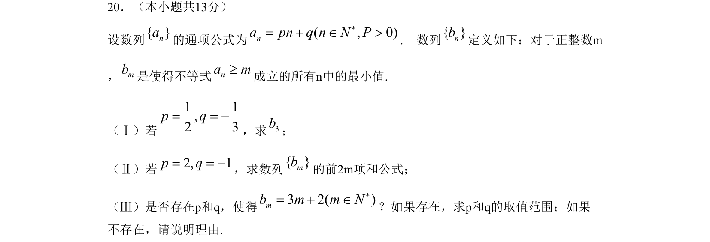
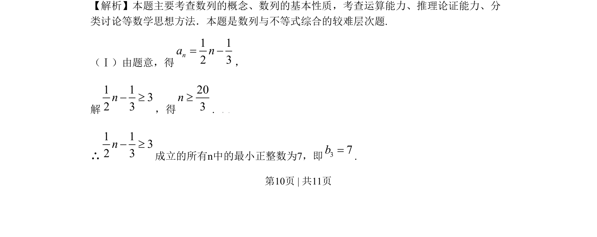
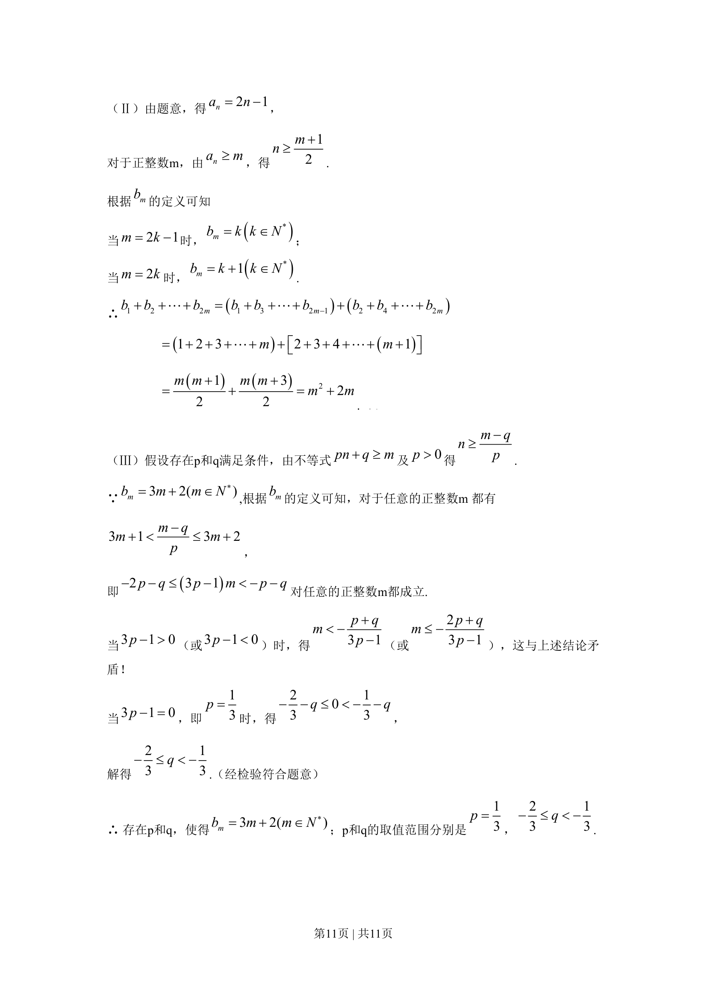

## 题面

## 摘要

数列与不等式综合题，通过解不等式求最小正整数，并探究参数存在性。

## 关联考点

- [[1307-数列的通项公式|数列的通项公式]]
- [[623-不等式求解|不等式求解]]
- [[424-参数分类讨论|分类讨论]]
- [[428-存在性问题|存在性问题]]

## 答案与解析

> 📄 原 PDF 第 10 页：`素材/真题/北京/2008-2024·（北京）数学高考真题/2009年高考数学试卷（文）（北京）（解析卷）.pdf`
