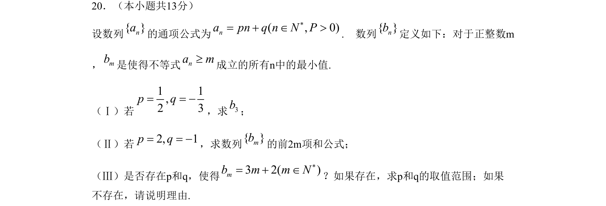
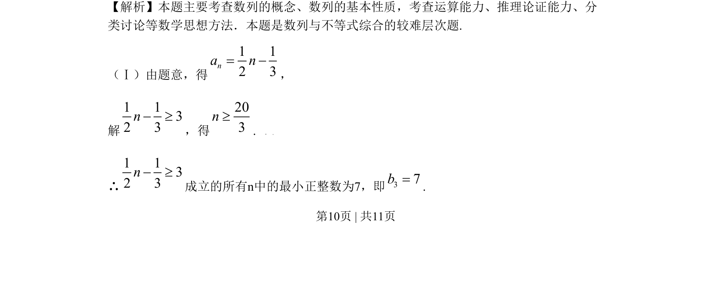
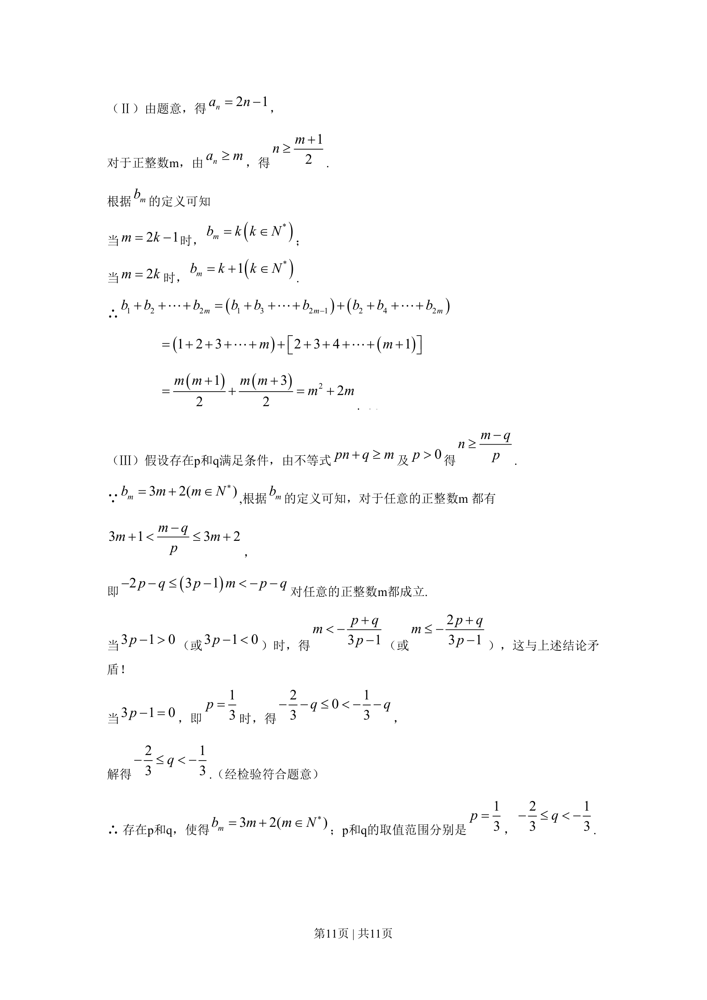

## 题面

## 摘要

数列与不等式综合题，通过解不等式求最小正整数，并探究参数存在性。

## 关联考点

- [[384-数列通项公式|数列的通项公式]]
- [[623-不等式求解|不等式求解]]
- [[424-参数分类讨论|分类讨论]]
- [[428-存在性问题|存在性问题]]

## 答案与解析

> 📄 原 PDF 第 10 页：`素材/真题/北京/2008-2024·（北京）数学高考真题/2009年高考数学试卷（文）（北京）（解析卷）.pdf`

<!-- 题干文本-start -->
## 题干文本
20．（本小题共13分）
设数列 的通项公式为. 数列 定义如下：对于正整数m 
， 是使得不等式 成立的所有n中的最小值.
（Ⅰ）若 ，求 ；
（Ⅱ）若 ，求数列 的前2m项和公式；
（Ⅲ）是否存在p和q，使得 ？如果存在，求p和q的取值范围；如果
不存在，请说明理由.
<!-- 题干文本-end -->

<!-- 解析文本-start -->
## 解析文本
【解析】本题主要考查数列的概念、数列的基本性质，考查运算能力、推理论证能力、分
类讨论等数学思想方法．本题是数列与不等式综合的较难层次题.
（Ⅰ）由题意，得 ，
解 ，得.     
∴ 成立的所有n中的最小正整数为7，即.
2333accaì=ïïíï=ïî1, 3a c= =2 2 22b c a= - =C2212yx- =()()1 1 2 2, , ,x y x y()0 0,M x y22012x y myx- + =ìïí- =ïî2 22 2 0x mx m- - - =0D >1 20 0 0, 22x xx m y x m m+= = = + =()0 0,M x y2 25x y+ =()222 5m m+ =1m= ±{ }na( , 0)na pn q n N P*= + Î >{ }nbmbna m³1 1,2 3p q= = -3b2, 1p q= = -{ }mb3 2( )mb m m N*= + Î1 12 3na n= -1 132 3n- ³203n³
1 132 3n- ³37b=
<!-- 解析文本-end -->
