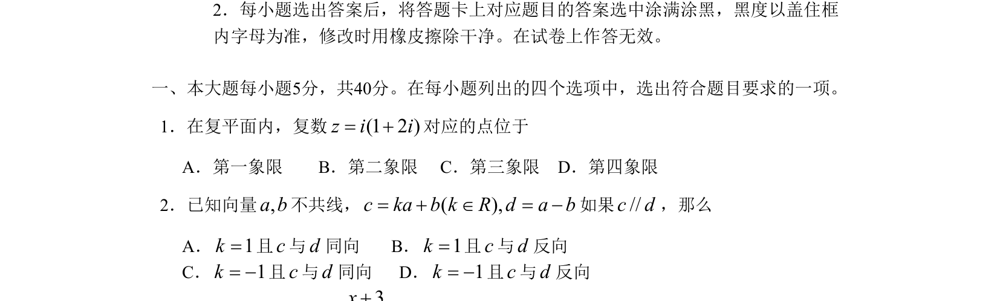

## 题面

## 摘要

本题主要考查向量的共线（平行）与加减法，通过特例排除选项。

## 关联考点

- [[743-向量共线|向量共线]]
- [[744-向量加减法|向量加减法]]

## 答案与解析

> 📄 原 PDF 第 1 页：`素材/真题/北京/2008-2024·（北京）数学高考真题/2009年高考数学试卷（理）（北京）（解析卷）.pdf`

<!-- 题干文本-start -->
## 题干文本
2．每小题选出答案后，将答题卡上对应题目的答案选中涂满涂黑，黑度以盖住框
内字母为准，修改时用橡皮擦除干净。在试卷上作答无效。
一、本大题每小题5分，共40分。在每小题列出的四个选项中，选出符合题目要求的一项。
1．在复平面内，复数(1 2 )z i i= +对应的点位于
       A．第一象限        B．第二象限     C．第三象限    D．第四象限
2．已知向量,a b不共线，( ),c ka b k R d a b= + Î = -如果//c d，那么
       A．1k=且c与d同向       B．1k=且c与d反向
       C．1k= -且c与d同向      D．1k= -且c与d反向
<!-- 题干文本-end -->

<!-- 解析文本-start -->
## 解析文本

<!-- 解析文本-end -->
