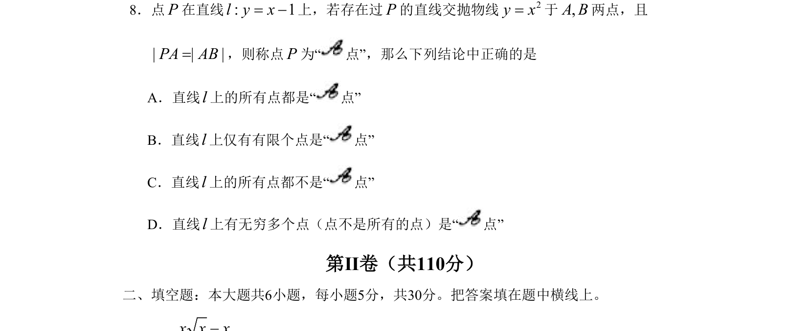

## 题面

## 摘要

考查信息迁移能力，利用数形结合法将几何条件转化为方程，借助判别式恒成立判断选项。

## 关联考点

- [[897-数形结合|数形结合]]
- [[1263-函数与方程|函数与方程]]
- [[229-根的判别式|判别式]]
- [[恒成立]]

## 答案与解析

> 📄 原 PDF 第 2 页：`素材/真题/北京/2008-2024·（北京）数学高考真题/2009年高考数学试卷（理）（北京）（解析卷）.pdf`
