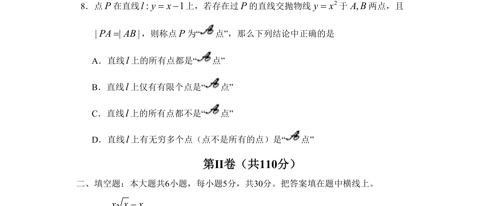

## 题面

## 摘要

考查信息迁移能力，利用数形结合法将几何条件转化为方程，借助判别式恒成立判断选项。

## 关联考点

- [[897-数形结合|数形结合]]
- [[1263-函数与方程|函数与方程]]
- [[229-根的判别式|判别式]]
- [[恒成立]]

## 答案与解析

> 📄 原 PDF 第 2 页：`素材/真题/北京/2008-2024·（北京）数学高考真题/2009年高考数学试卷（理）（北京）（解析卷）.pdf`

<!-- 题干文本-start -->
## 题干文本
8．点P在直线: 1l y x= -上，若存在过P的直线交抛物线2y x=于,A B两点，且
| | |PA AB=，则称点P为“点”，那么下列结论中正确的是
       A．直线l上的所有点都是“点”
       B．直线l上仅有有限个点是“点”
       C．直线l上的所有点都不是“点”
       D．直线l上有无穷多个点（点不是所有的点）是“点” 
第Ⅱ卷（共110分）
二、填空题：本大题共6小题，每小题5分，共30分。把答案填在题中横线上。
<!-- 题干文本-end -->

<!-- 解析文本-start -->
## 解析文本

<!-- 解析文本-end -->
