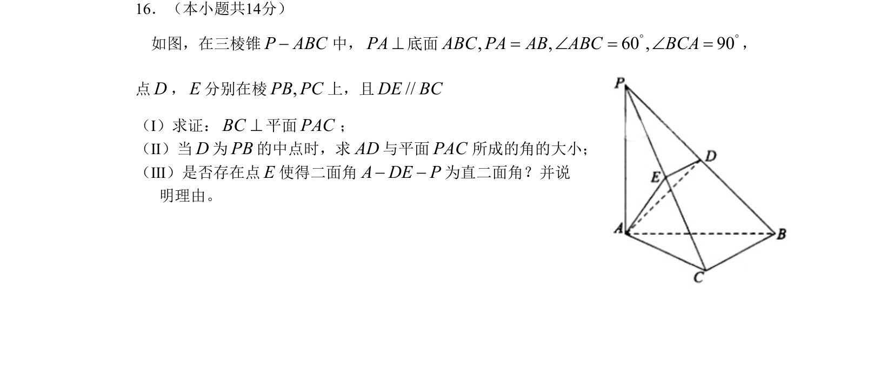

## 题面

## 摘要

本题为三棱锥中证明线面垂直、求线面角以及探索直二面角的存在性问题。

## 关联考点

- [[1085-线面垂直的判定|线面垂直的判定]]
- [[353-空间角|线面角]]
- [[353-空间角|二面角]]
- [[空间几何综合]]

## 答案与解析

> 📄 原 PDF 第 3 页：`素材/真题/北京/2008-2024·（北京）数学高考真题/2009年高考数学试卷（理）（北京）（解析卷）.pdf`
