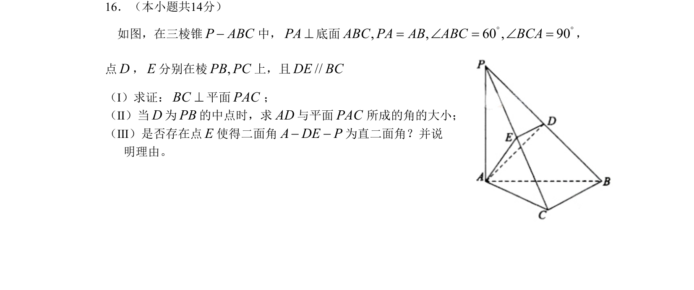

## 题面

## 摘要

本题为三棱锥中证明线面垂直、求线面角以及探索直二面角的存在性问题。

## 关联考点

- [[1085-线面垂直的判定|线面垂直的判定]]
- [[353-空间角|线面角]]
- [[353-空间角|二面角]]
- [[空间几何综合]]

## 答案与解析

> 📄 原 PDF 第 3 页：`素材/真题/北京/2008-2024·（北京）数学高考真题/2009年高考数学试卷（理）（北京）（解析卷）.pdf`

<!-- 题干文本-start -->
## 题干文本
16．（本小题共14分）
    如图，在三棱锥P ABC-中，PA^底面, , 60 , 90ABC PA AB ABC BCA° °= Ð = Ð =，
点D，E分别在棱,PB PC上，且//DE BC
（I）求证：BC^平面PAC；
（Ⅱ）当D为PB的中点时，求AD与平面PAC所成的角的大小；
（Ⅲ）是否存在点E使得二面角A DE P- -为直二面角？并说
      明理由。
<!-- 题干文本-end -->

<!-- 解析文本-start -->
## 解析文本

<!-- 解析文本-end -->
