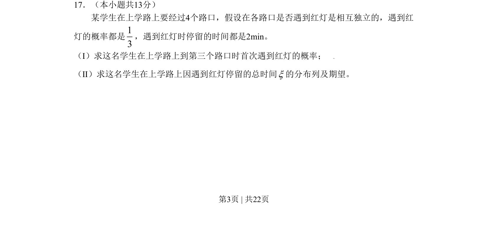

## 题面

## 摘要

一名学生经过4个路口，每个路口独立且红灯概率固定，求首次遇到红灯的概率及停留总时间的分布与期望。

## 关联考点

- [[318-事件的独立性|独立重复试验]]
- [[几何分布]]
- [[469-二项分布|二项分布]]
- [[1185-分布列与期望|分布列与期望]]

## 答案与解析

> 📄 原 PDF 第 3 页：`素材/真题/北京/2008-2024·（北京）数学高考真题/2009年高考数学试卷（理）（北京）（解析卷）.pdf`
