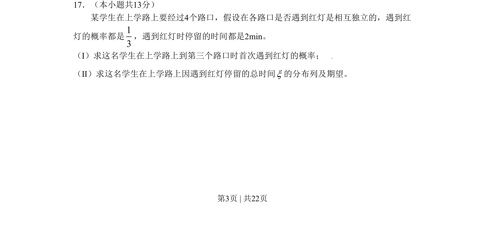

## 题面

## 摘要

一名学生经过4个路口，每个路口独立且红灯概率固定，求首次遇到红灯的概率及停留总时间的分布与期望。

## 关联考点

- [[318-事件的独立性|独立重复试验]]
- [[几何分布]]
- [[469-二项分布|二项分布]]
- [[1184-分布列与期望|分布列与期望]]

## 答案与解析

> 📄 原 PDF 第 3 页：`素材/真题/北京/2008-2024·（北京）数学高考真题/2009年高考数学试卷（理）（北京）（解析卷）.pdf`

<!-- 题干文本-start -->
## 题干文本
17．（本小题共13分）
某学生在上学路上要经过4个路口，假设在各路口是否遇到红灯是相互独立的，遇到红
灯的概率都是13
，遇到红灯时停留的时间都是2min。
（Ⅰ）求这名学生在上学路上到第三个路口时首次遇到红灯的概率；w.w.w.k.s.5.u.c.o.m              
（Ⅱ）求这名学生在上学路上因遇到红灯停留的总时间x的分布列及期望。
<!-- 题干文本-end -->

<!-- 解析文本-start -->
## 解析文本

<!-- 解析文本-end -->
