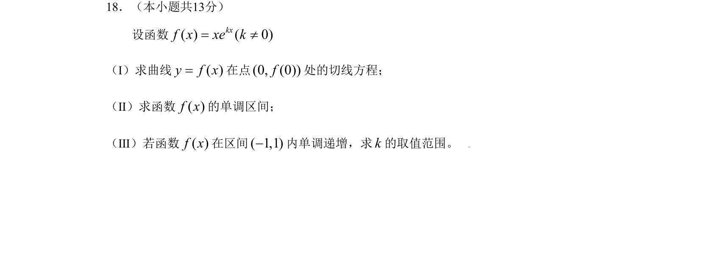

## 题面

## 摘要

考查利用导数求切线、判断单调性并求参数取值范围

## 关联考点

- [[440-导数的几何意义|导数的几何意义]]
- [[705-利用导数研究函数的单调性|利用导数研究函数的单调性]]
- [[含参不等式求解]]

## 答案与解析

> 📄 原 PDF 第 4 页：`素材/真题/北京/2008-2024·（北京）数学高考真题/2009年高考数学试卷（理）（北京）（解析卷）.pdf`
