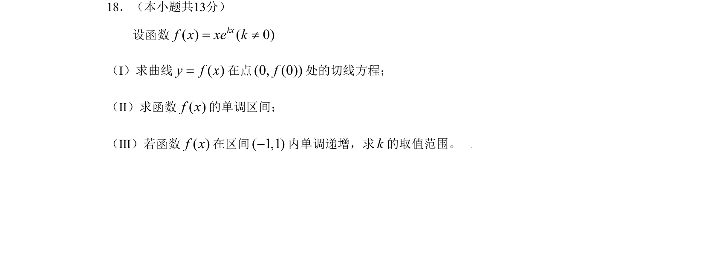

## 题面

## 摘要

考查利用导数求切线、判断单调性并求参数取值范围

## 关联考点

- [[440-导数的几何意义|导数的几何意义]]
- [[705-利用导数研究函数的单调性|利用导数研究函数的单调性]]
- [[含参不等式求解]]

## 答案与解析

> 📄 原 PDF 第 4 页：`素材/真题/北京/2008-2024·（北京）数学高考真题/2009年高考数学试卷（理）（北京）（解析卷）.pdf`

<!-- 题干文本-start -->
## 题干文本
18．（本小题共13分）
设函数( ) ( 0)kxf x xe k= ¹
（I）求曲线( )y f x=在点(0, (0))f处的切线方程；
（Ⅱ）求函数( )f x的单调区间；
（Ⅲ）若函数( )f x在区间( 1,1)-内单调递增，求k的取值范围。w.w.w.k.s.5.u.c.o.m
<!-- 题干文本-end -->

<!-- 解析文本-start -->
## 解析文本

<!-- 解析文本-end -->
