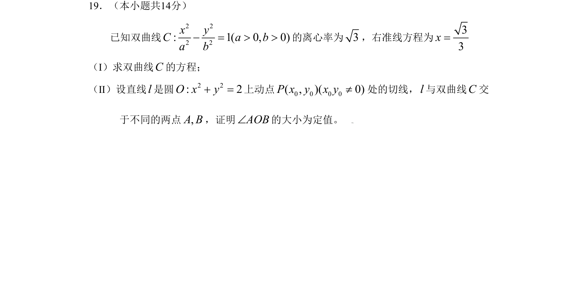

## 题面

## 摘要

已知双曲线离心率与右准线方程求标准方程，并结合圆的切线证明直线与双曲线交点构成的角为定值。

## 关联考点

- [[538-双曲线标准方程|双曲线标准方程]]
- [[391-椭圆离心率|离心率]]
- [[1166-准线|准线]]
- [[217-切线|圆的切线]]
- [[377-定点定值问题|定值问题]]

## 答案与解析

> 📄 原 PDF 第 4 页：`素材/真题/北京/2008-2024·（北京）数学高考真题/2009年高考数学试卷（理）（北京）（解析卷）.pdf`
