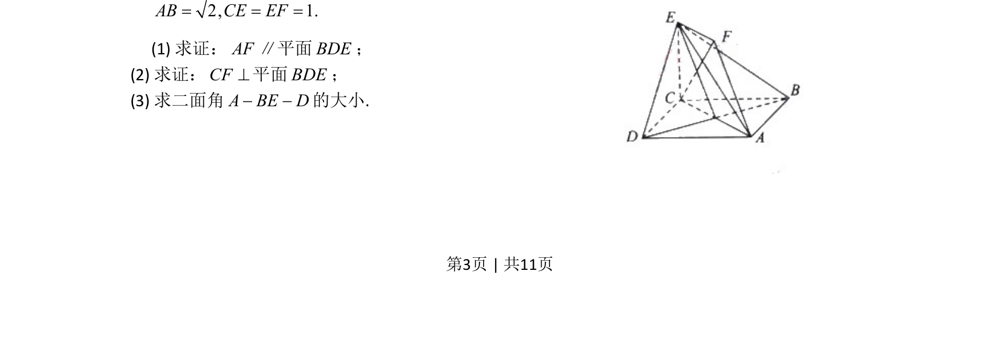
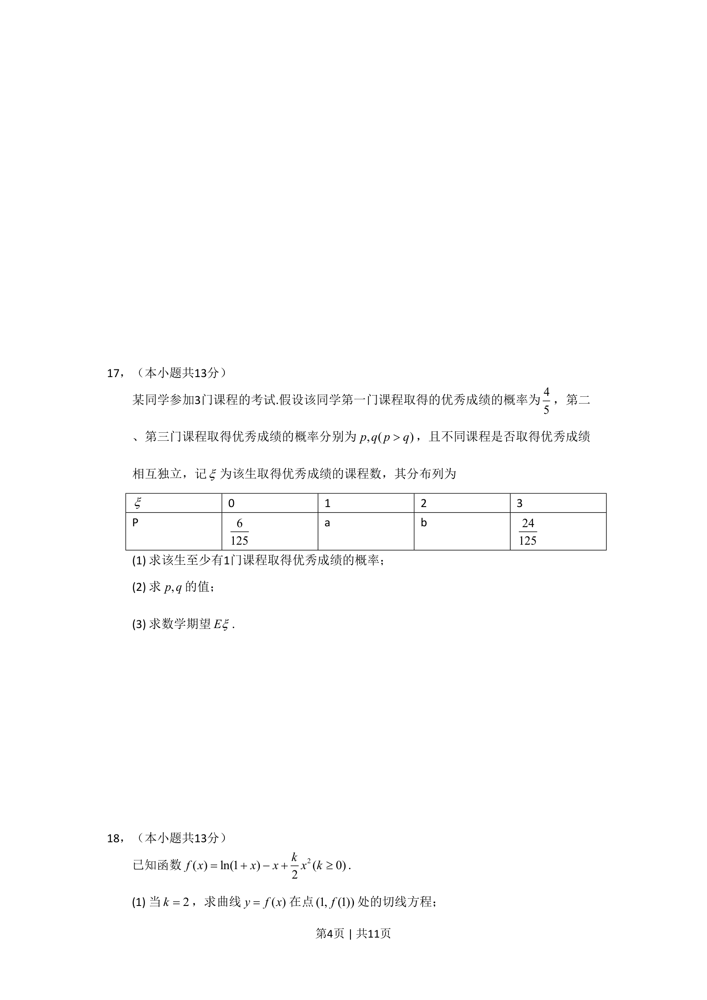
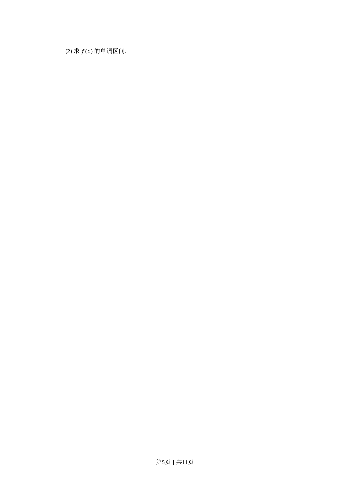
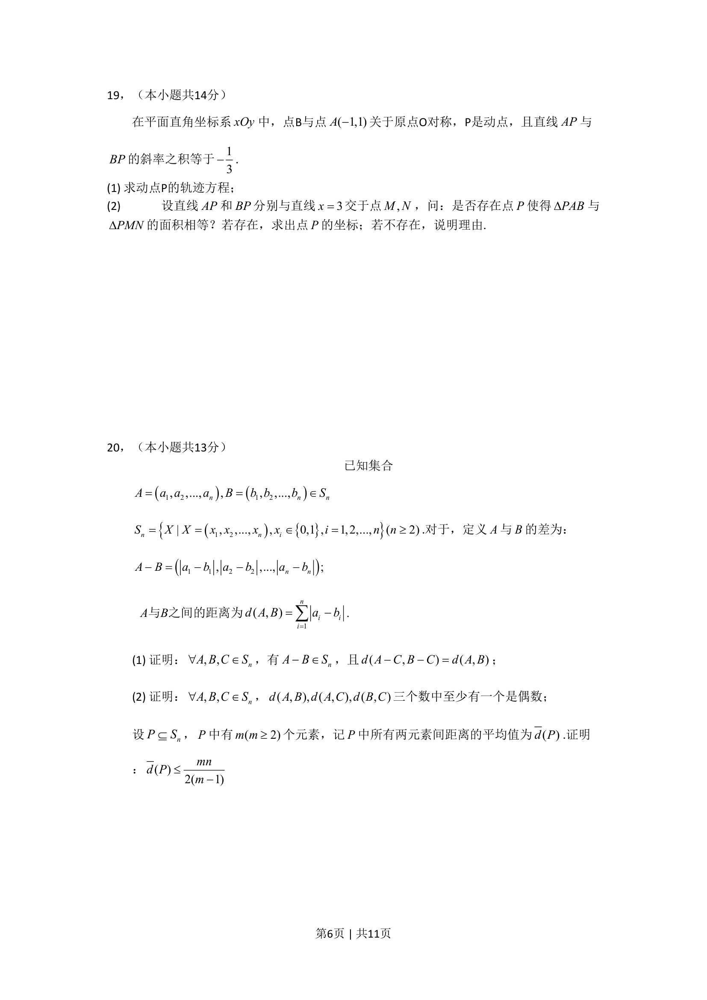
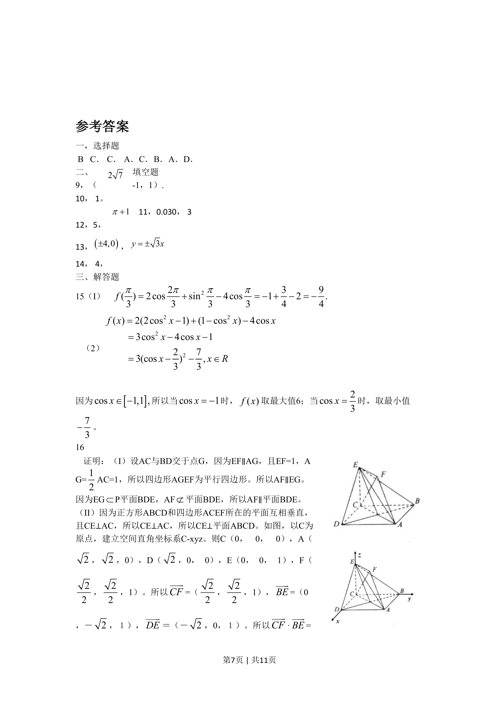
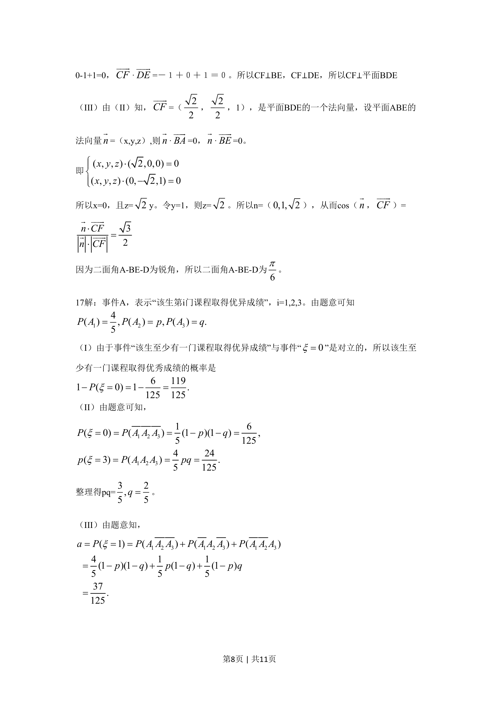
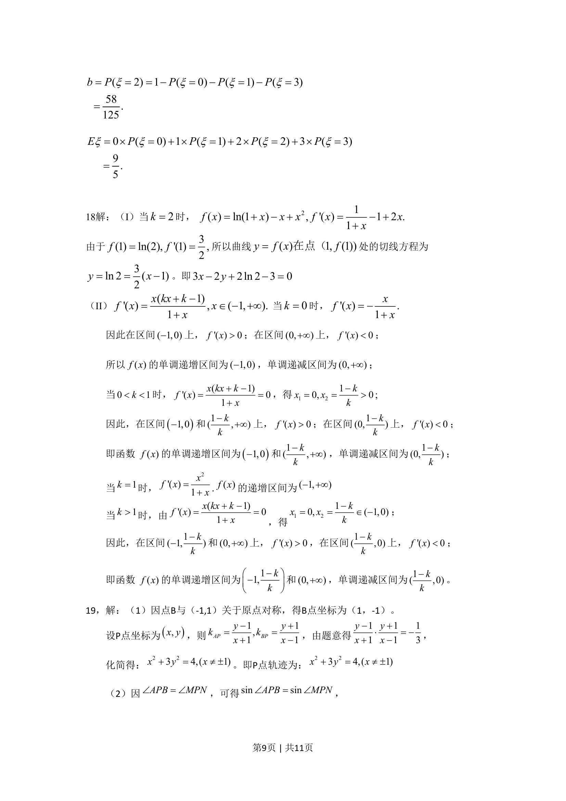
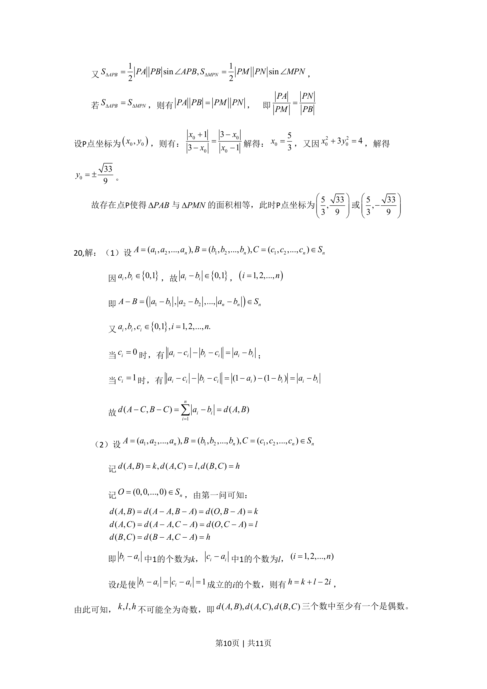
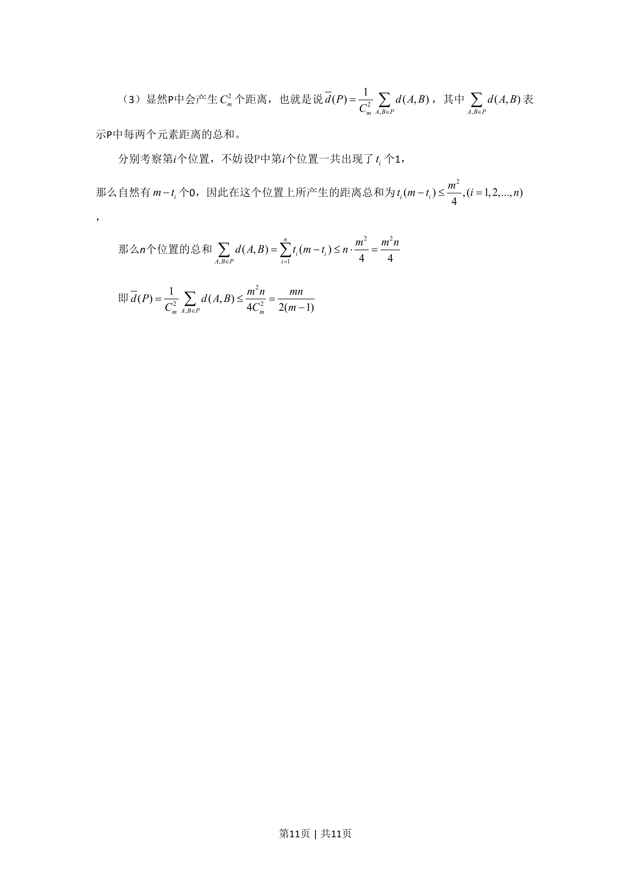

## 题面

## 摘要

本题考查线面平行与垂直的证明及二面角大小的计算。

## 关联考点

- [[352-空间直线平面平行|线面平行]]
- [[1087-线面垂直的判定与性质|线面垂直]]
- [[353-空间角|二面角]]

## 答案与解析

> 📄 原 PDF 第 3 页：`素材/真题/北京/2008-2024·（北京）数学高考真题/2010年高考数学试卷（文）（北京）（解析卷）.pdf`
