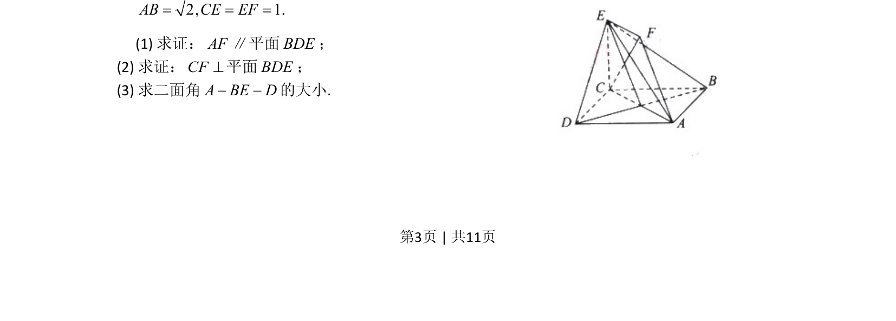
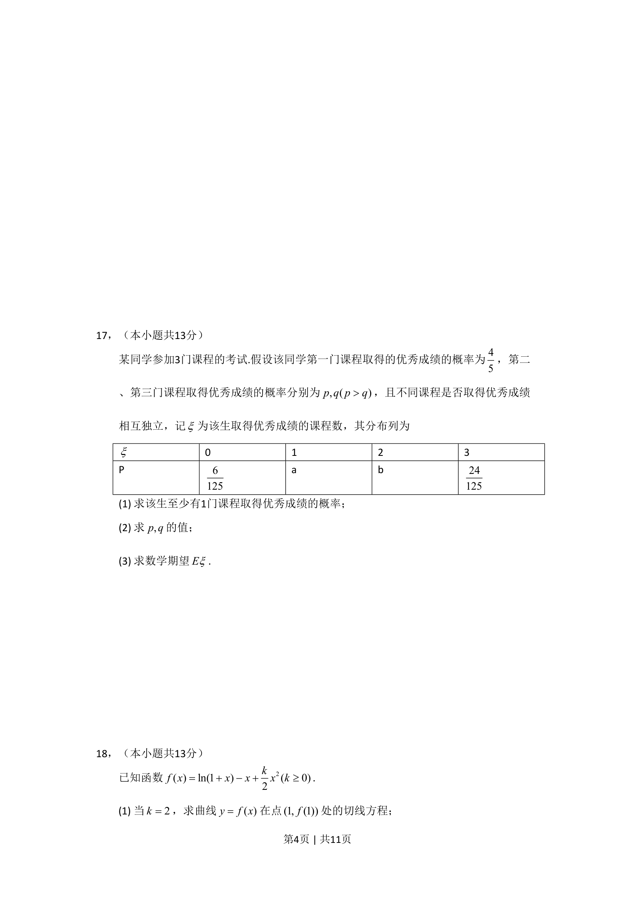
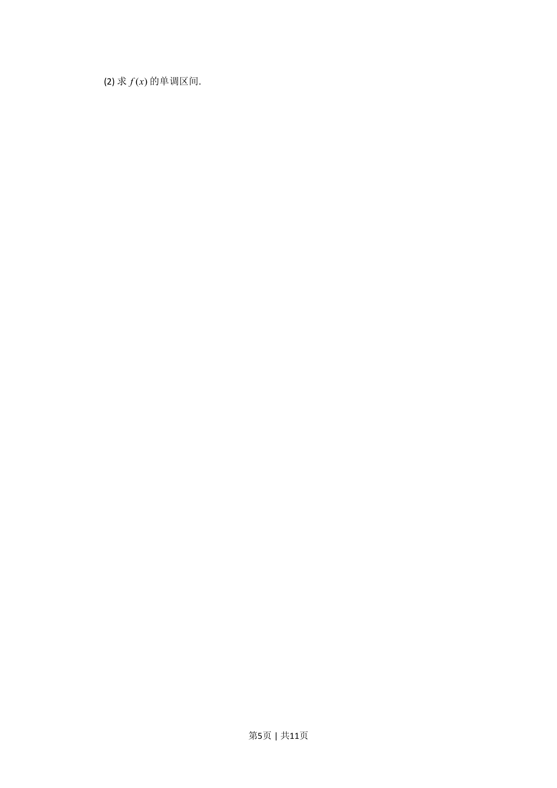
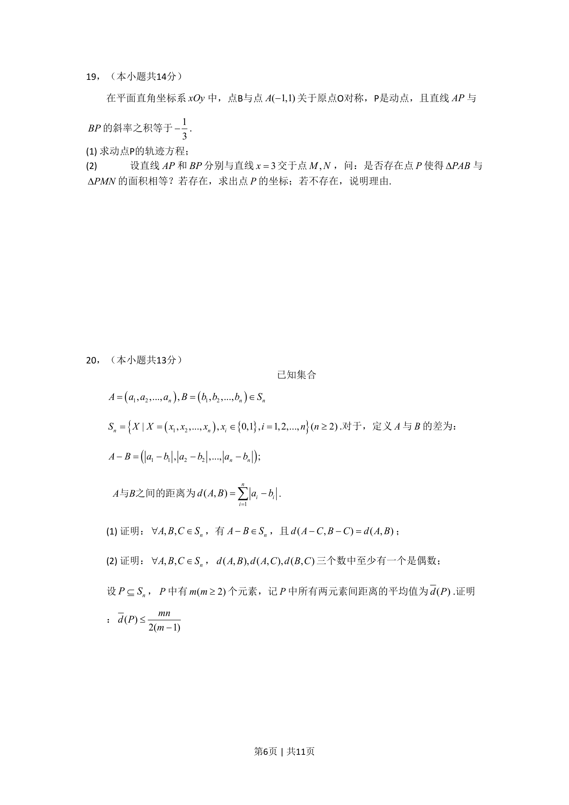
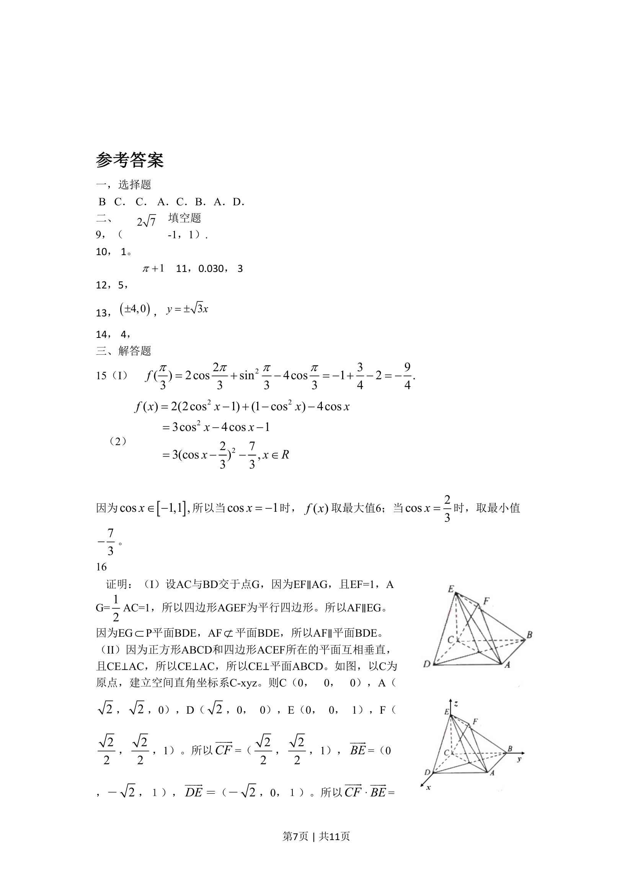
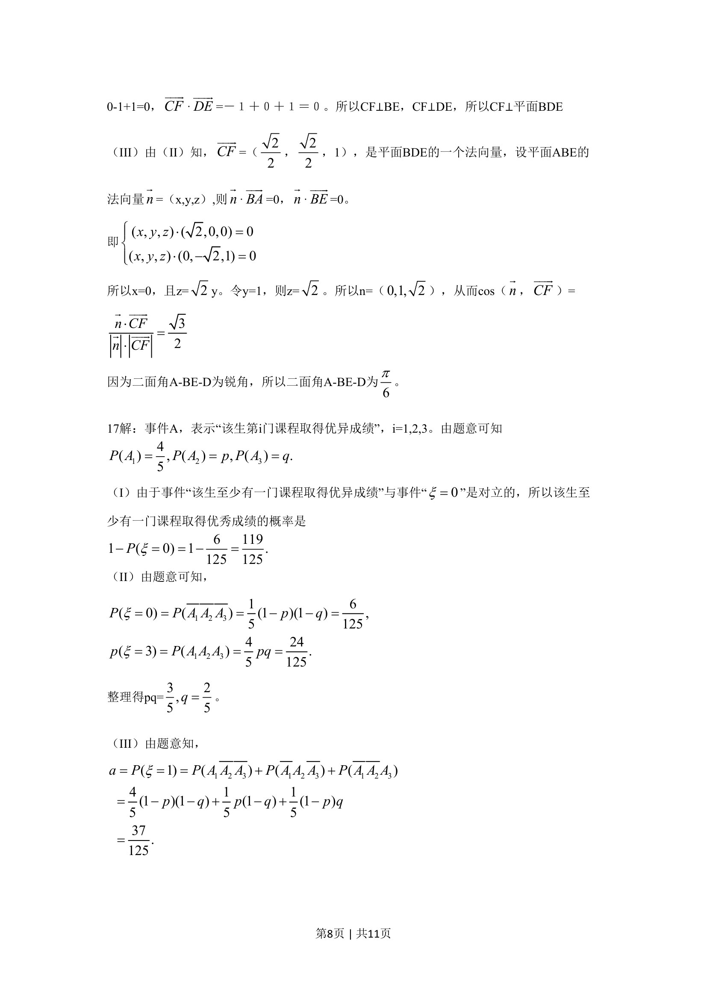
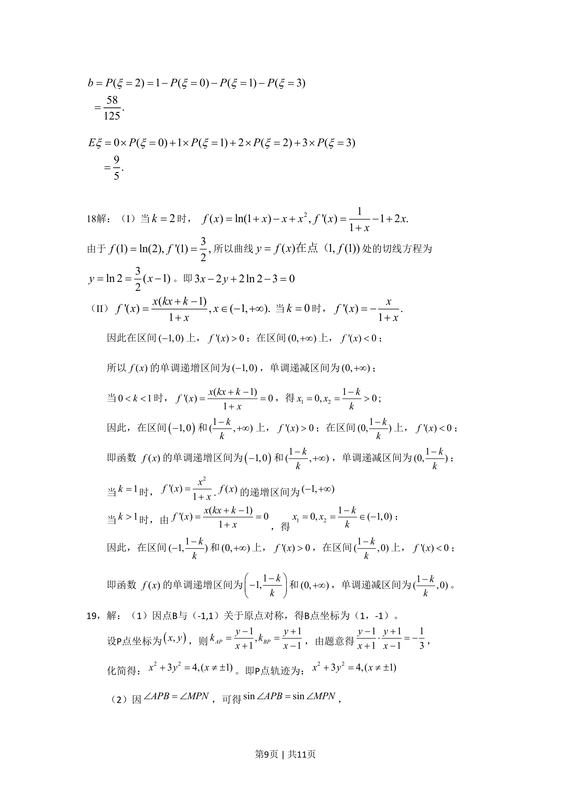
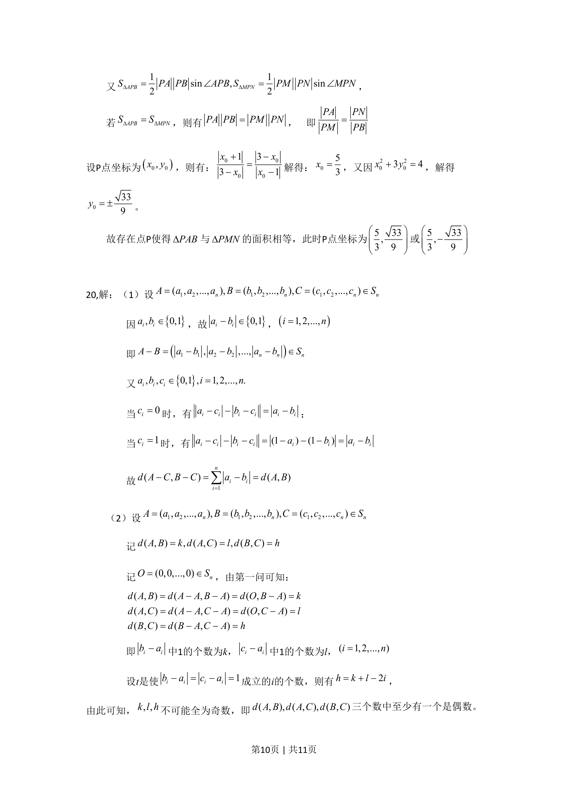
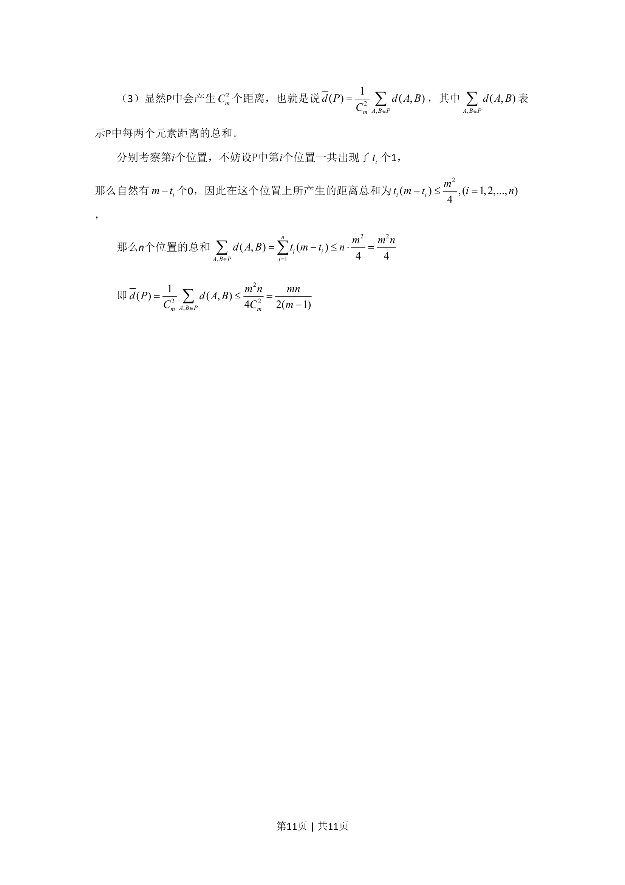

## 题面

## 摘要

本题考查线面平行与垂直的证明及二面角大小的计算。

## 关联考点

- [[352-空间直线平面平行|线面平行]]
- [[1086-线面垂直的判定与性质|线面垂直]]
- [[353-空间角|二面角]]

## 答案与解析

> 📄 原 PDF 第 3 页：`素材/真题/北京/2008-2024·（北京）数学高考真题/2010年高考数学试卷（文）（北京）（解析卷）.pdf`

<!-- 题干文本-start -->
## 题干文本

<!-- 题干文本-end -->

<!-- 解析文本-start -->
## 解析文本
第3页 | 共11页  
13，已知双曲线
2 22 21x ya b- =的离心率为2，焦点与椭圆
2 2125 9x y+ =的焦点相同，那么双
曲线的焦点坐标为______；渐近线方程为_______.
14，如图放置的边长为1的正方形PABC沿x轴滚动，
设顶点( , )P x y的轨迹方程是( )y f x=，则函数( )f x的
最小正周期为_____；( )y f x=在其两个相邻零点间的
图象与x轴所围区域的面积为_______.
说明：“正方形PABC沿x轴滚动”包括沿x轴正方向
和沿x轴负方向滚动.沿x轴正方向滚动指的是先以顶点A为中心顺时针旋转，当顶点
B落在x轴上时，再以顶点B为中心顺时针旋转，如此继续.类似地，正方形PABC沿x
轴负方向滚动.
三、 解答题。本大题共6小题，共80分。解答应写出文字说明，演算步骤或证明过程
。
15，（本小题共13分）
已知函数 2( ) 2cos 2 sin 4cos ,f x x x x= + -
（I） 求( )3fp的值；
（II） 求( )f x的最大值和最小值.
16，（本小题共14分）
如图，正方形ABCD和四边形ACEF所在的平面互相垂直，CE AC^，EF∥AC，
2, 1.AB CE EF= = =
(1) 求证：AF∥平面BDE；
    (2) 求证：CF^平面BDE；
    (3) 求二面角A BE D- -的大小.
<!-- 解析文本-end -->
