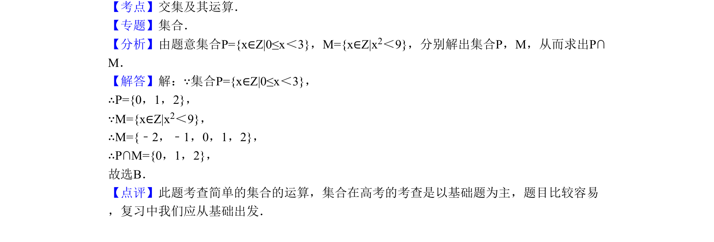

## 题面

## 摘要

本题考查集合的交集运算，给出描述法表示的集合，需先求解不等式确定元素。

## 关联考点

- [[集合的描述法]]
- [[267-一元二次不等式|一元二次不等式]]
- [[646-交集运算|交集运算]]

## 答案与解析

> 📄 原 PDF 第 1 页：`素材/真题/北京/2008-2024·（北京）数学高考真题/2010年高考数学试卷（理）（北京）（解析卷）.pdf`

<!-- 题干文本-start -->
## 题干文本
1．（5分）（2010•北京）（北京卷理1）集合P={x∈Z|0≤x＜3}，M={x∈Z|x2＜9}，则P∩M=
（　　）
A．{1，2} B．{0，1，2} C．{x|0≤x＜3} D．{x|0≤x≤3}
<!-- 题干文本-end -->

<!-- 解析文本-start -->
## 解析文本
【考点】交集及其运算．菁优网版权所有
【专题】集合．
【分析】由题意集合P={x∈Z|0≤x＜3}，M={x∈Z|x2＜9}，分别解出集合P，M，从而求出P∩
M．
【解答】解：∵集合P={x∈Z|0≤x＜3}，
∴P={0，1，2}，
∵M={x∈Z|x2＜9}，
∴M={﹣2，﹣1，0，1，2}，
∴P∩M={0，1，2}，
故选B．
【点评】此题考查简单的集合的运算，集合在高考的考查是以基础题为主，题目比较容易
，复习中我们应从基础出发．
<!-- 解析文本-end -->
