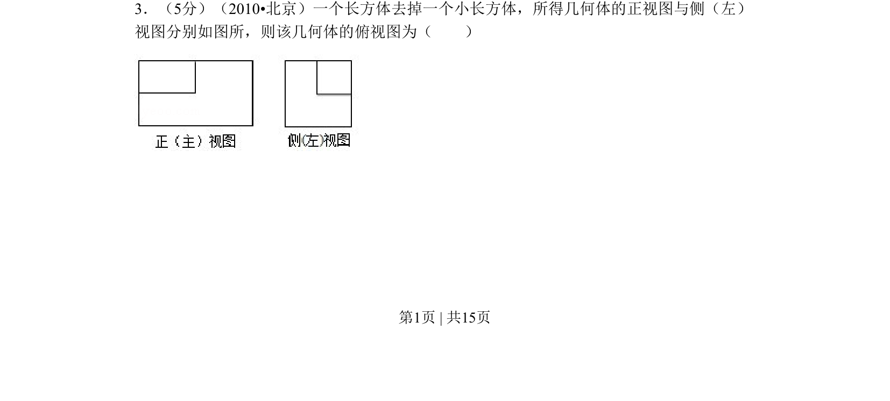
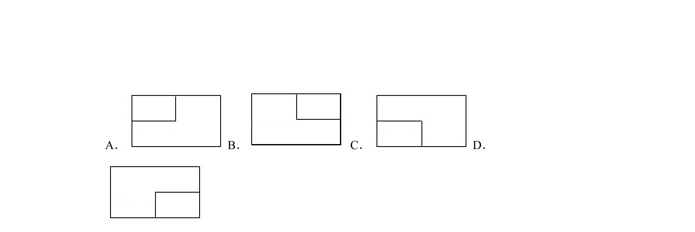
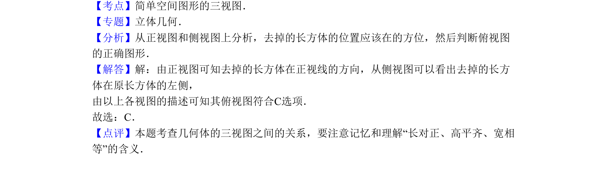

## 题面

## 摘要

一个长方体去掉一个小长方体后，由给定正视图与侧视图推断俯视图。

## 关联考点

- [[235-三视图|三视图]]
- [[1045-空间几何体|空间几何体]]
- [[1200-空间几何体的直观图|直观图]]

## 答案与解析

> 📄 原 PDF 第 1 页：`素材/真题/北京/2008-2024·（北京）数学高考真题/2010年高考数学试卷（理）（北京）（解析卷）.pdf`
