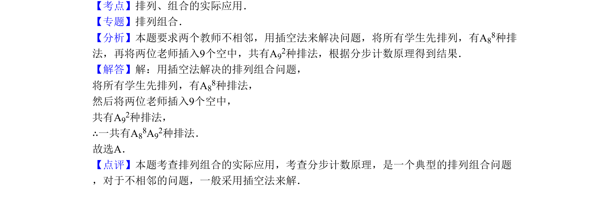

## 题面

## 摘要

8名学生和2位老师站成一排，求老师不相邻的排列数。

## 关联考点

- [[031-搭配|排列组合]]
- [[483-排列应用-不相邻问题|不相邻问题]]
- [[483-排列应用-不相邻问题|插空法]]
- [[477-分步计数原理|分步计数原理]]

## 答案与解析

> 📄 原 PDF 第 2 页：`素材/真题/北京/2008-2024·（北京）数学高考真题/2010年高考数学试卷（理）（北京）（解析卷）.pdf`

<!-- 题干文本-start -->
## 题干文本
4．（5分）（2010•北京）8名学生和2位老师站成一排合影，2位老师不相邻的排法种数为
（　　）
A．A88A92 B．A88C92 C．A88A72 D．A88C72
<!-- 题干文本-end -->

<!-- 解析文本-start -->
## 解析文本
【考点】排列、组合的实际应用．菁优网版权所有
【专题】排列组合．
【分析】本题要求两个教师不相邻，用插空法来解决问题，将所有学生先排列，有A88种排
法，再将两位老师插入9个空中，共有A92种排法，根据分步计数原理得到结果．
【解答】解：用插空法解决的排列组合问题，
将所有学生先排列，有A88种排法，
然后将两位老师插入9个空中，
共有A92种排法，
∴一共有A88A92种排法．
故选A．
【点评】本题考查排列组合的实际应用，考查分步计数原理，是一个典型的排列组合问题
，对于不相邻的问题，一般采用插空法来解．
<!-- 解析文本-end -->
