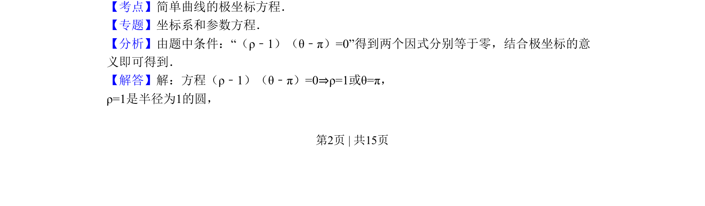
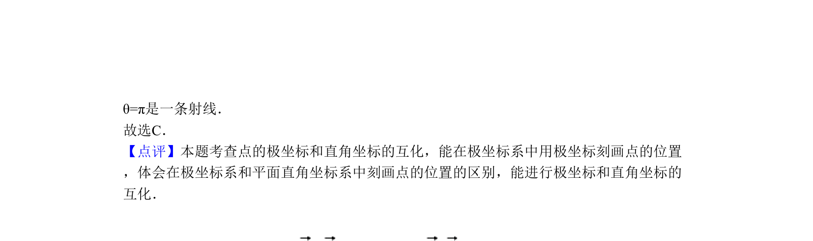

## 题面

## 摘要

极坐标方程表示圆与射线，通过因式分解识别曲线类型

## 关联考点

- [[922-极坐标方程|极坐标方程]]
- [[圆的极坐标方程]]
- [[090-射线|射线]]
- [[曲线图形]]

## 答案与解析

> 📄 原 PDF 第 2 页：`素材/真题/北京/2008-2024·（北京）数学高考真题/2010年高考数学试卷（理）（北京）（解析卷）.pdf`
