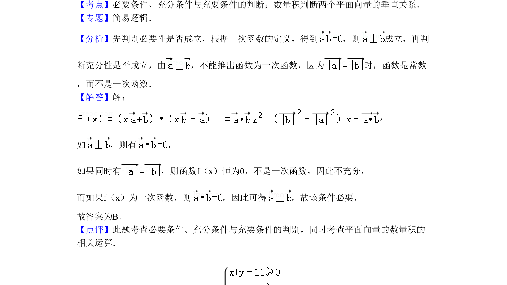

## 题面

## 摘要

该题以向量垂直和一次函数定义为背景，考查充分条件与必要条件的逻辑判断。

## 关联考点

- [[533-充分必要条件|充分必要条件]]
- [[328-向量的数量积|数量积]]
- [[542-向量垂直|向量垂直]]
- [[177-一次函数定义|一次函数]]

## 答案与解析

> 📄 原 PDF 第 3 页：`素材/真题/北京/2008-2024·（北京）数学高考真题/2010年高考数学试卷（理）（北京）（解析卷）.pdf`
