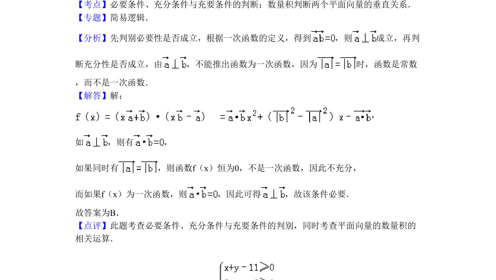

## 题面

## 摘要

该题以向量垂直和一次函数定义为背景，考查充分条件与必要条件的逻辑判断。

## 关联考点

- [[533-充分必要条件|充分必要条件]]
- [[328-向量的数量积|数量积]]
- [[542-向量垂直|向量垂直]]
- [[177-一次函数定义|一次函数]]

## 答案与解析

> 📄 原 PDF 第 3 页：`素材/真题/北京/2008-2024·（北京）数学高考真题/2010年高考数学试卷（理）（北京）（解析卷）.pdf`

<!-- 题干文本-start -->
## 题干文本
6．（5分）（2010•北京）若 ， 是非零向量，“⊥”是“函数
为一次函数”的（　　）
A．充分而不必要条件B．必要不充分条件
C．充分必要条件D．既不充分也不必要条件
<!-- 题干文本-end -->

<!-- 解析文本-start -->
## 解析文本
【考点】必要条件、充分条件与充要条件的判断；数量积判断两个平面向量的垂直关系．菁优网版权所有
【专题】简易逻辑．
【分析】先判别必要性是否成立，根据一次函数的定义，得到 ，则 成立，再判
断充分性是否成立，由 ，不能推出函数为一次函数，因为 时，函数是常数
，而不是一次函数．
【解答】解：
，
如 ，则有 ，
如果同时有 ，则函数f（x）恒为0，不是一次函数，因此不充分，
而如果f（x）为一次函数，则 ，因此可得 ，故该条件必要．
故答案为B．
【点评】此题考查必要条件、充分条件与充要条件的判别，同时考查平面向量的数量积的
相关运算．
<!-- 解析文本-end -->
