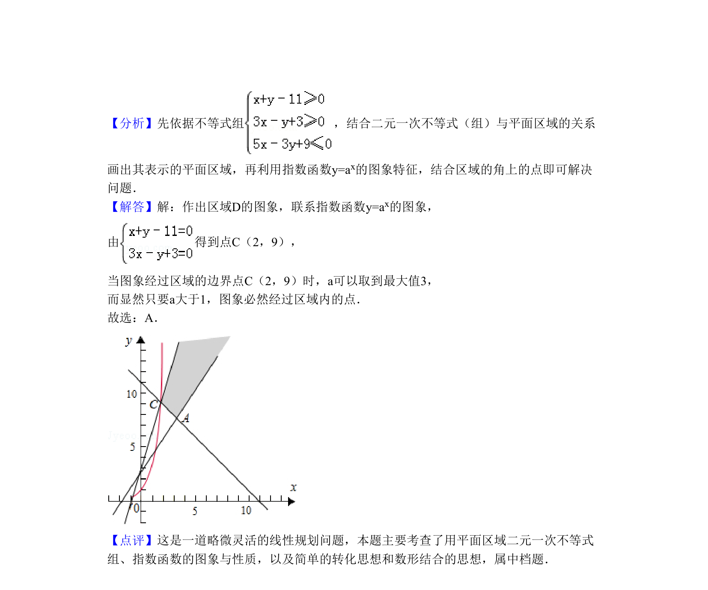

## 题面

## 摘要

不等式组表示的平面区域与指数函数图象有公共点，求参数范围

## 关联考点

- [[1366-二元一次不等式组与平面区域|二元一次不等式组与平面区域]]
- [[指数函数的图像与性质]]

## 答案与解析

> 📄 原 PDF 第 3 页：`素材/真题/北京/2008-2024·（北京）数学高考真题/2010年高考数学试卷（理）（北京）（解析卷）.pdf`

<!-- 题干文本-start -->
## 题干文本
7．（5分）（2010•北京）设不等式组 表示的平面区域为D，若指数函数y=
ax的图象上存在区域D上的点，则a的取值范围是（　　）
A．（1，3]B．[2，3]C．（1，2]D．[3，+∞]
<!-- 题干文本-end -->

<!-- 解析文本-start -->
## 解析文本
【考点】二元一次不等式（组）与平面区域；指数函数的图像与性质．菁优网版权所有
【专题】不等式的解法及应用．
<!-- 解析文本-end -->
