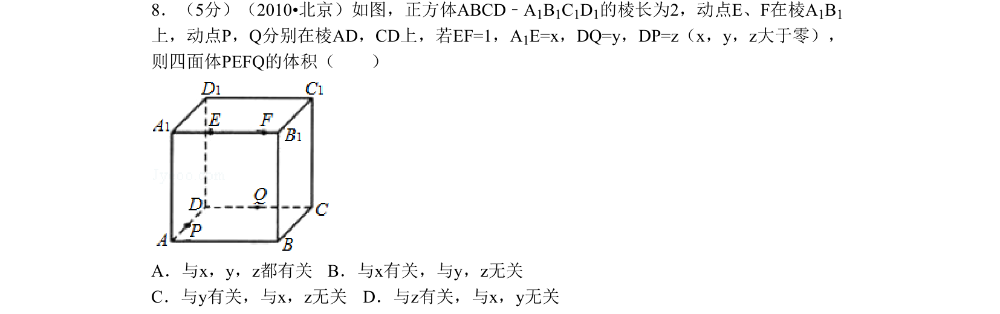
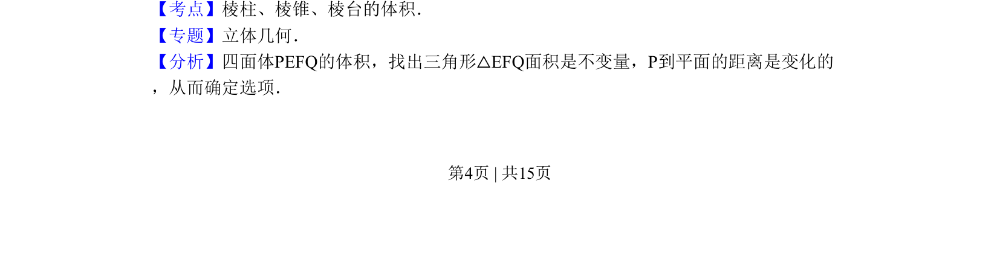
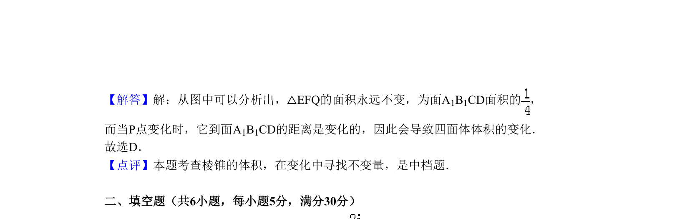

## 题面

## 摘要

该题考查正方体中动点位置变化对四面体体积的影响，需分析底面面积与高的不变性。

## 关联考点

- [[346-空间几何体-多面体|棱柱]]
- [[346-空间几何体-多面体|棱锥]]
- [[1387-棱台的体积|棱台的体积]]
- [[1055-立体几何|立体几何]]
- [[动点分析]]

## 答案与解析

> 📄 原 PDF 第 4 页：`素材/真题/北京/2008-2024·（北京）数学高考真题/2010年高考数学试卷（理）（北京）（解析卷）.pdf`
