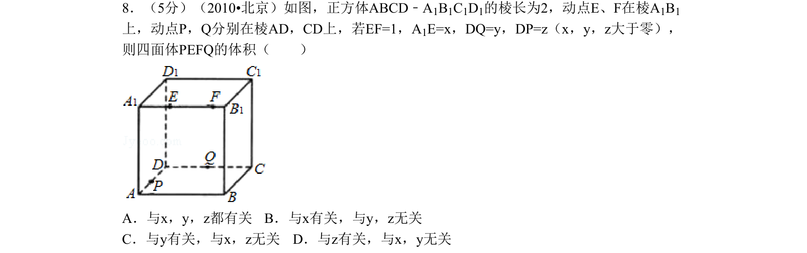
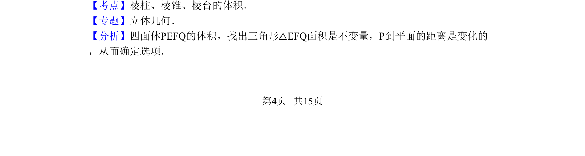
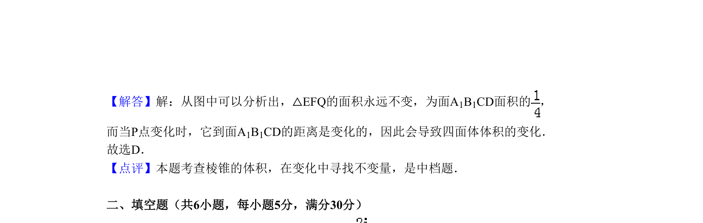

## 题面

## 摘要

该题考查正方体中动点位置变化对四面体体积的影响，需分析底面面积与高的不变性。

## 关联考点

- [[346-空间几何体-多面体|棱柱]]
- [[346-空间几何体-多面体|棱锥]]
- [[1387-棱台的体积|棱台的体积]]
- [[1055-立体几何|立体几何]]
- [[动点分析]]

## 答案与解析

> 📄 原 PDF 第 4 页：`素材/真题/北京/2008-2024·（北京）数学高考真题/2010年高考数学试卷（理）（北京）（解析卷）.pdf`

<!-- 题干文本-start -->
## 题干文本
8．（5分）（2010•北京）如图，正方体ABCD﹣A1B1C1D1的棱长为2，动点E、F在棱A1B1
上，动点P，Q分别在棱AD，CD上，若EF=1，A1E=x，DQ=y，DP=z（x，y，z大于零），
则四面体PEFQ的体积（　　）
A．与x，y，z都有关B．与x有关，与y，z无关
C．与y有关，与x，z无关D．与z有关，与x，y无关
<!-- 题干文本-end -->

<!-- 解析文本-start -->
## 解析文本
【考点】棱柱、棱锥、棱台的体积．菁优网版权所有
【专题】立体几何．
【分析】四面体PEFQ的体积，找出三角形△EFQ面积是不变量，P到平面的距离是变化的
，从而确定选项．
<!-- 解析文本-end -->
