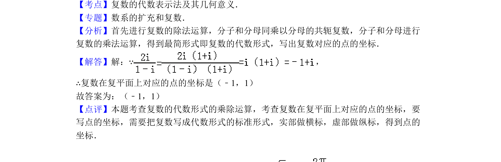

## 题面

## 摘要

在复平面内求复数对应点的坐标，涉及复数除法、代数形式与几何意义。

## 关联考点

- [[332-复数的乘除运算|复数除法]]
- [[复数的代数表示法]]
- [[333-复数的几何意义|复数的几何意义]]

## 答案与解析

> 📄 原 PDF 第 5 页：`素材/真题/北京/2008-2024·（北京）数学高考真题/2010年高考数学试卷（理）（北京）（解析卷）.pdf`
