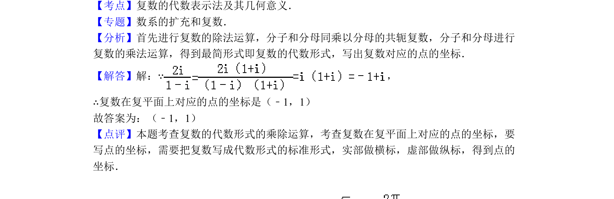

## 题面

## 摘要

在复平面内求复数对应点的坐标，涉及复数除法、代数形式与几何意义。

## 关联考点

- [[332-复数的乘除运算|复数除法]]
- [[复数的代数表示法]]
- [[333-复数的几何意义|复数的几何意义]]

## 答案与解析

> 📄 原 PDF 第 5 页：`素材/真题/北京/2008-2024·（北京）数学高考真题/2010年高考数学试卷（理）（北京）（解析卷）.pdf`

<!-- 题干文本-start -->
## 题干文本
9．（5分）（2010•北京）在复平面内，复数 对应的点的坐标为　（﹣1，1）　．
<!-- 题干文本-end -->

<!-- 解析文本-start -->
## 解析文本
【考点】复数的代数表示法及其几何意义．菁优网版权所有
【专题】数系的扩充和复数．
【分析】首先进行复数的除法运算，分子和分母同乘以分母的共轭复数，分子和分母进行
复数的乘法运算，得到最简形式即复数的代数形式，写出复数对应的点的坐标．
【解答】解：∵，
∴复数在复平面上对应的点的坐标是（﹣1，1）
故答案为：（﹣1，1）
【点评】本题考查复数的代数形式的乘除运算，考查复数在复平面上对应的点的坐标，要
写点的坐标，需要把复数写成代数形式的标准形式，实部做横标，虚部做纵标，得到点的
坐标．
<!-- 解析文本-end -->
