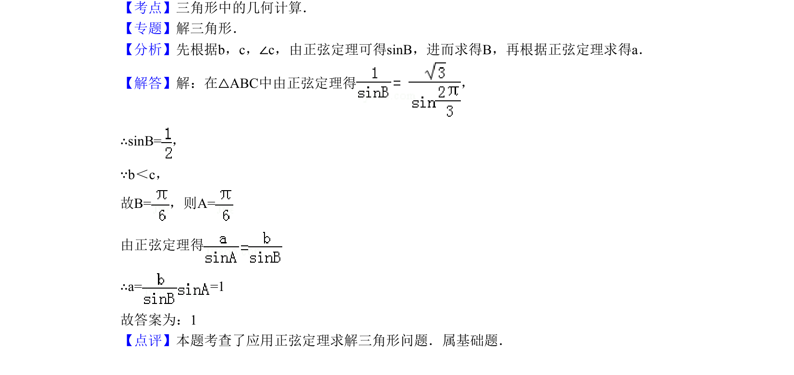

## 题面

## 摘要

三角形中已知两边及一角，利用正弦定理求第三边。

## 关联考点

- [[126-定理|正弦定理]]
- [[589-解三角形|解三角形]]

## 答案与解析

> 📄 原 PDF 第 5 页：`素材/真题/北京/2008-2024·（北京）数学高考真题/2010年高考数学试卷（理）（北京）（解析卷）.pdf`

<!-- 题干文本-start -->
## 题干文本
10．（5分）（2010•北京）在△ABC中，若b=1，c=，∠C=，则a=　1　．
<!-- 题干文本-end -->

<!-- 解析文本-start -->
## 解析文本
【考点】三角形中的几何计算．菁优网版权所有
【专题】解三角形．
【分析】先根据b，c，∠c，由正弦定理可得sinB，进而求得B，再根据正弦定理求得a．
【解答】解：在△ABC中由正弦定理得 ，
∴sinB=，
∵b＜c，
故B=，则A=
由正弦定理得
∴a= =1
故答案为：1
【点评】本题考查了应用正弦定理求解三角形问题．属基础题．
<!-- 解析文本-end -->
