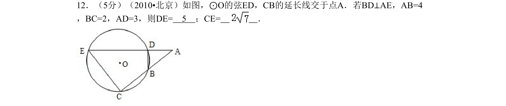
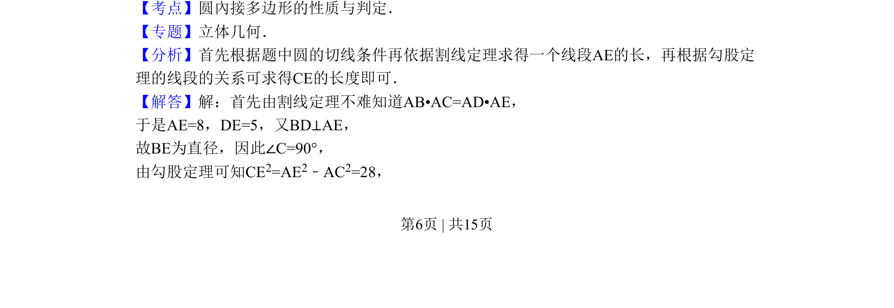
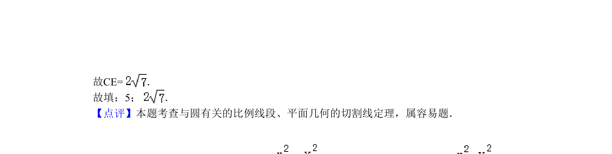

## 题面

## 摘要

本题利用割线定理和直角三角形的勾股定理求圆中弦长与线段长。

## 关联考点

- [[割线定理]]
- [[189-勾股定理|勾股定理]]
- [[圆内接多边形性质]]

## 答案与解析

> 📄 原 PDF 第 6 页：`素材/真题/北京/2008-2024·（北京）数学高考真题/2010年高考数学试卷（理）（北京）（解析卷）.pdf`

<!-- 题干文本-start -->
## 题干文本
12．（5分）（2010•北京）如图，⊙O的弦ED，CB的延长线交于点A．若BD⊥AE，AB=4
，BC=2，AD=3，则DE=　5　；CE=　 　．
<!-- 题干文本-end -->

<!-- 解析文本-start -->
## 解析文本
【考点】圆內接多边形的性质与判定．菁优网版权所有
【专题】立体几何．
【分析】首先根据题中圆的切线条件再依据割线定理求得一个线段AE的长，再根据勾股定
理的线段的关系可求得CE的长度即可．
【解答】解：首先由割线定理不难知道AB•AC=AD•AE，
于是AE=8，DE=5，又BD⊥AE，
故BE为直径，因此∠C=90°，
由勾股定理可知CE2=AE2﹣AC2=28，
<!-- 解析文本-end -->
