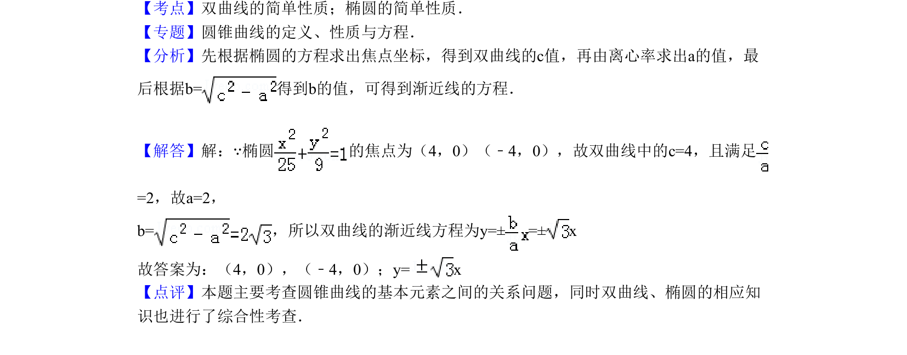

## 题面

## 摘要

椭圆与双曲线焦点相同，由离心率求双曲线焦点及渐近线方程。

## 关联考点

- [[双曲线的简单性质]]
- [[椭圆的简单性质]]

## 答案与解析

> 📄 原 PDF 第 7 页：`素材/真题/北京/2008-2024·（北京）数学高考真题/2010年高考数学试卷（理）（北京）（解析卷）.pdf`

<!-- 题干文本-start -->
## 题干文本
13．（5分）（2010•北京）已知双曲线 的离心率为2，焦点与椭圆 的
焦点相同，那么双曲线的焦点坐标为　（4，0），（﹣4，0）　；渐近线方程为　y=
x　．
<!-- 题干文本-end -->

<!-- 解析文本-start -->
## 解析文本
【考点】双曲线的简单性质；椭圆的简单性质．菁优网版权所有
【专题】圆锥曲线的定义、性质与方程．
【分析】先根据椭圆的方程求出焦点坐标，得到双曲线的c值，再由离心率求出a的值，最
后根据b=得到b的值，可得到渐近线的方程．
【解答】解：∵椭圆 的焦点为（4，0）（﹣4，0），故双曲线中的c=4，且满足
=2，故a=2，
b=，所以双曲线的渐近线方程为y=± =± x
故答案为：（4，0），（﹣4，0）；y= x
【点评】本题主要考查圆锥曲线的基本元素之间的关系问题，同时双曲线、椭圆的相应知
识也进行了综合性考查．
<!-- 解析文本-end -->
