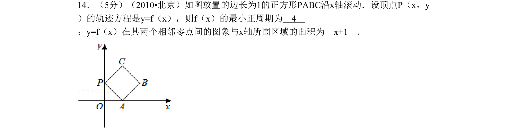
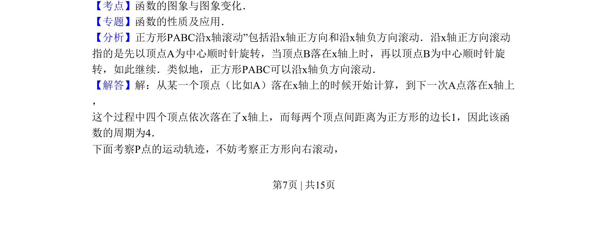
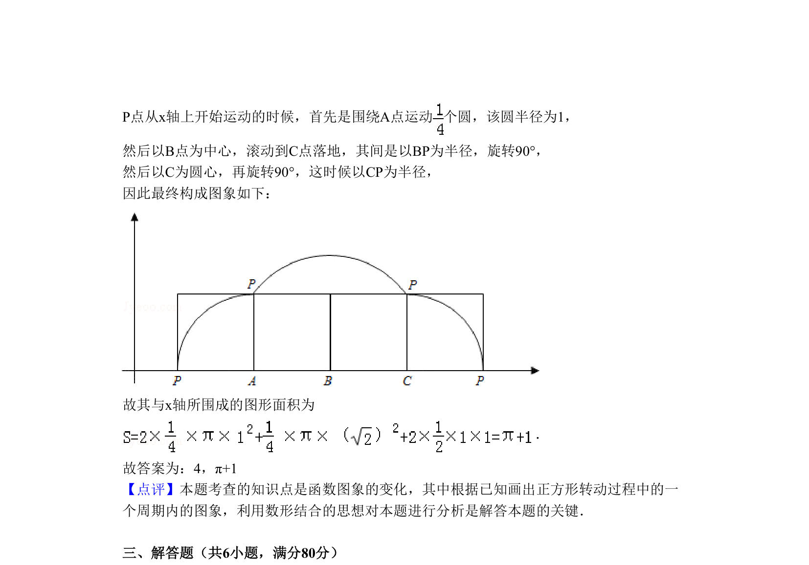

## 题面

## 摘要

正方形沿x轴滚动时顶点P的轨迹周期与面积计算，涉及滚动轨迹与几何综合。

## 关联考点

- [[函数的图象与图象变化]]
- [[687-函数的周期性|函数的周期性]]
- [[376-圆锥曲线轨迹问题|轨迹方程]]
- [[定积分求面积]]

## 答案与解析

> 📄 原 PDF 第 7 页：`素材/真题/北京/2008-2024·（北京）数学高考真题/2010年高考数学试卷（理）（北京）（解析卷）.pdf`
