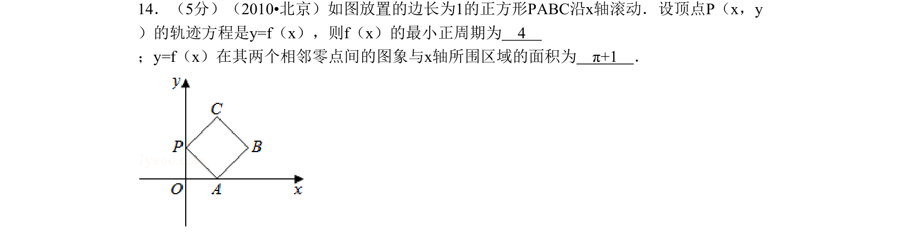
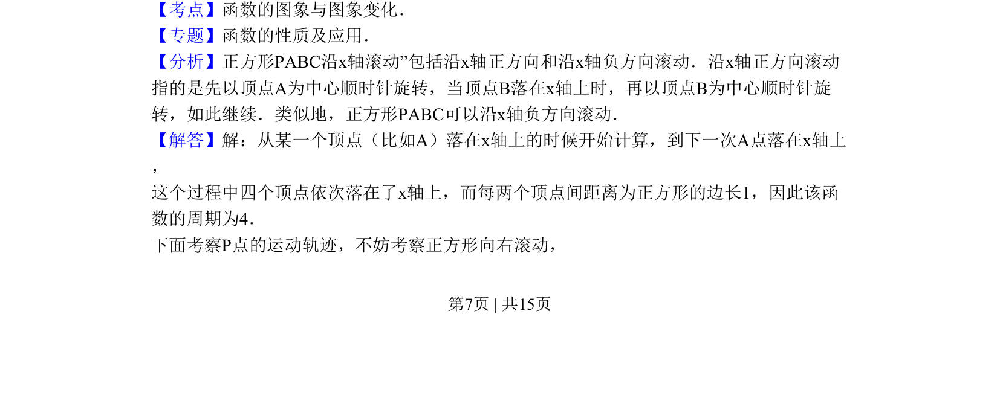
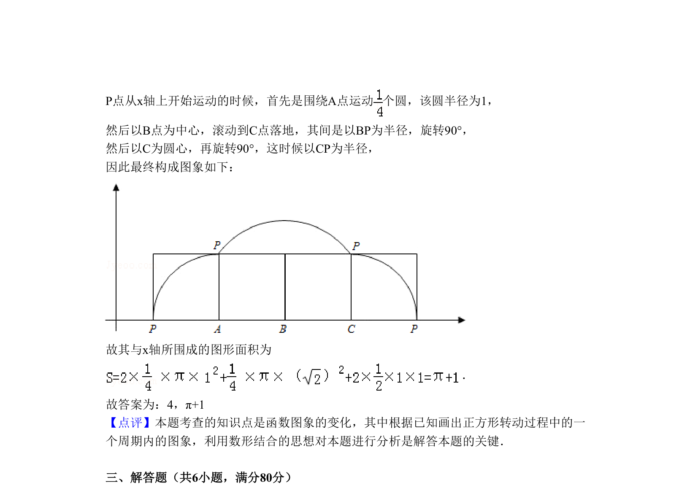

## 题面

## 摘要

正方形沿x轴滚动时顶点P的轨迹周期与面积计算，涉及滚动轨迹与几何综合。

## 关联考点

- [[函数的图象与图象变化]]
- [[687-函数的周期性|函数的周期性]]
- [[376-圆锥曲线轨迹问题|轨迹方程]]
- [[定积分求面积]]

## 答案与解析

> 📄 原 PDF 第 7 页：`素材/真题/北京/2008-2024·（北京）数学高考真题/2010年高考数学试卷（理）（北京）（解析卷）.pdf`

<!-- 题干文本-start -->
## 题干文本
14．（5分）（2010•北京）如图放置的边长为1的正方形PABC沿x轴滚动．设顶点P（x，y
）的轨迹方程是y=f（x），则f（x）的最小正周期为　4　
；y=f（x）在其两个相邻零点间的图象与x轴所围区域的面积为　π+1　．
<!-- 题干文本-end -->

<!-- 解析文本-start -->
## 解析文本
【考点】函数的图象与图象变化．菁优网版权所有
【专题】函数的性质及应用．
【分析】正方形PABC沿x轴滚动”包括沿x轴正方向和沿x轴负方向滚动．沿x轴正方向滚动
指的是先以顶点A为中心顺时针旋转，当顶点B落在x轴上时，再以顶点B为中心顺时针旋
转，如此继续．类似地，正方形PABC可以沿x轴负方向滚动．
【解答】解：从某一个顶点（比如A）落在x轴上的时候开始计算，到下一次A点落在x轴上
，
这个过程中四个顶点依次落在了x轴上，而每两个顶点间距离为正方形的边长1，因此该函
数的周期为4．
下面考察P点的运动轨迹，不妨考察正方形向右滚动，
<!-- 解析文本-end -->
