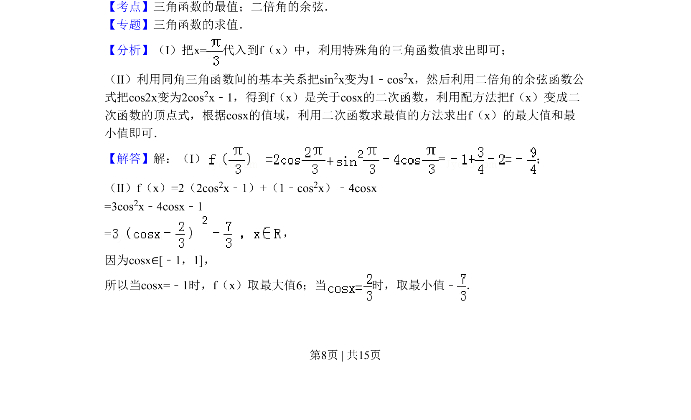
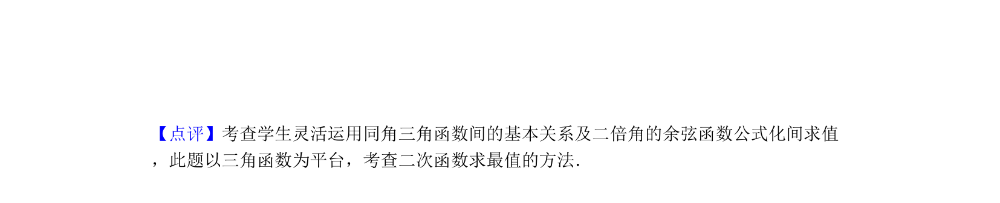

## 题面

## 摘要

求三角函数值及化为关于cosx的二次函数求最值

## 关联考点

- [[615-三角函数的最值|三角函数的最值]]
- [[二倍角的余弦]]
- [[741-同角三角函数基本关系|同角三角函数基本关系]]
- [[640-二次函数最值|二次函数最值]]

## 答案与解析

> 📄 原 PDF 第 8 页：`素材/真题/北京/2008-2024·（北京）数学高考真题/2010年高考数学试卷（理）（北京）（解析卷）.pdf`
