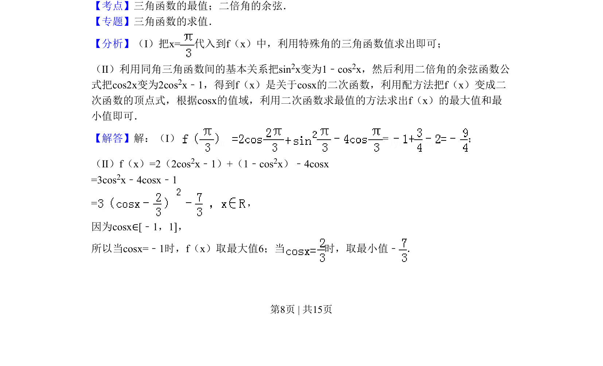
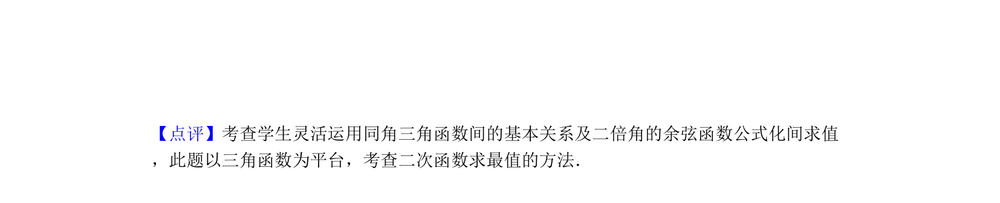

## 题面

## 摘要

求三角函数值及化为关于cosx的二次函数求最值

## 关联考点

- [[615-三角函数的最值|三角函数的最值]]
- [[二倍角的余弦]]
- [[741-同角三角函数基本关系|同角三角函数基本关系]]
- [[640-二次函数最值|二次函数最值]]

## 答案与解析

> 📄 原 PDF 第 8 页：`素材/真题/北京/2008-2024·（北京）数学高考真题/2010年高考数学试卷（理）（北京）（解析卷）.pdf`

<!-- 题干文本-start -->
## 题干文本
15．（13分）（2010•北京）已知函数f（x）=2cos2x+sin2x﹣4cosx．
（Ⅰ）求 的值；
（Ⅱ）求f（x）的最大值和最小值．
<!-- 题干文本-end -->

<!-- 解析文本-start -->
## 解析文本
【考点】三角函数的最值；二倍角的余弦．菁优网版权所有
【专题】三角函数的求值．
【分析】（Ⅰ）把x=代入到f（x）中，利用特殊角的三角函数值求出即可；
（Ⅱ）利用同角三角函数间的基本关系把sin2x变为1﹣cos2x，然后利用二倍角的余弦函数公
式把cos2x变为2cos2x﹣1，得到f（x）是关于cosx的二次函数，利用配方法把f（x）变成二
次函数的顶点式，根据cosx的值域，利用二次函数求最值的方法求出f（x）的最大值和最
小值即可．
【解答】解：（Ⅰ）=；
（Ⅱ）f（x）=2（2cos2x﹣1）+（1﹣cos2x）﹣4cosx
=3cos2x﹣4cosx﹣1
=，
因为cosx∈[﹣1，1]，
所以当cosx=﹣1时，f（x）取最大值6；当 时，取最小值﹣ ．
<!-- 解析文本-end -->
