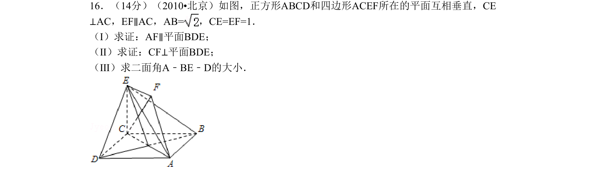
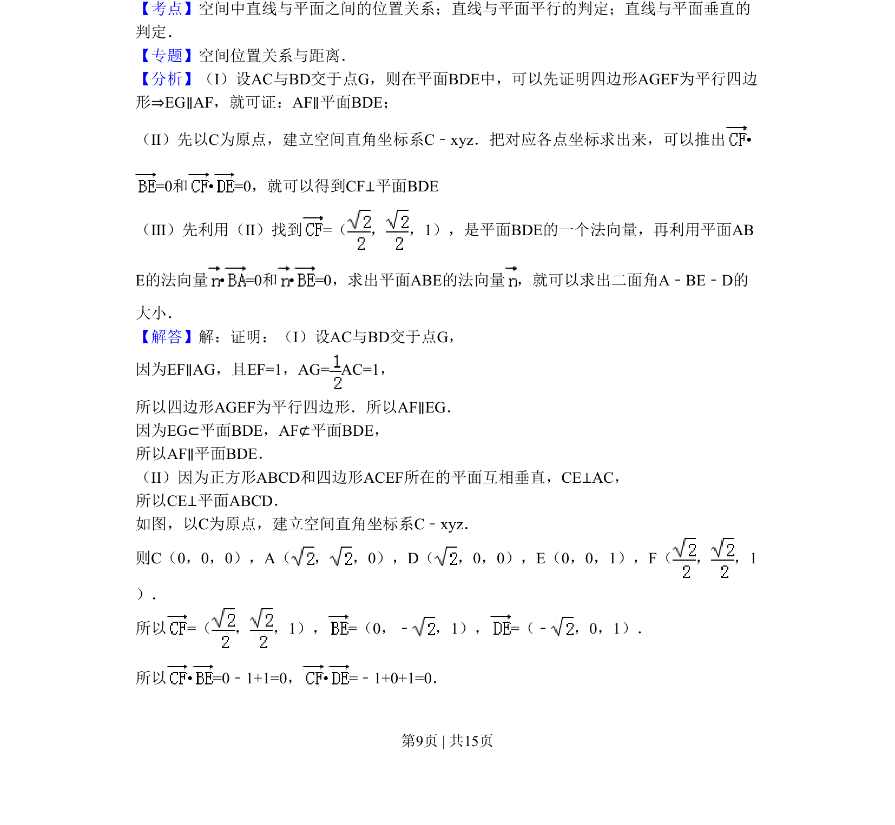
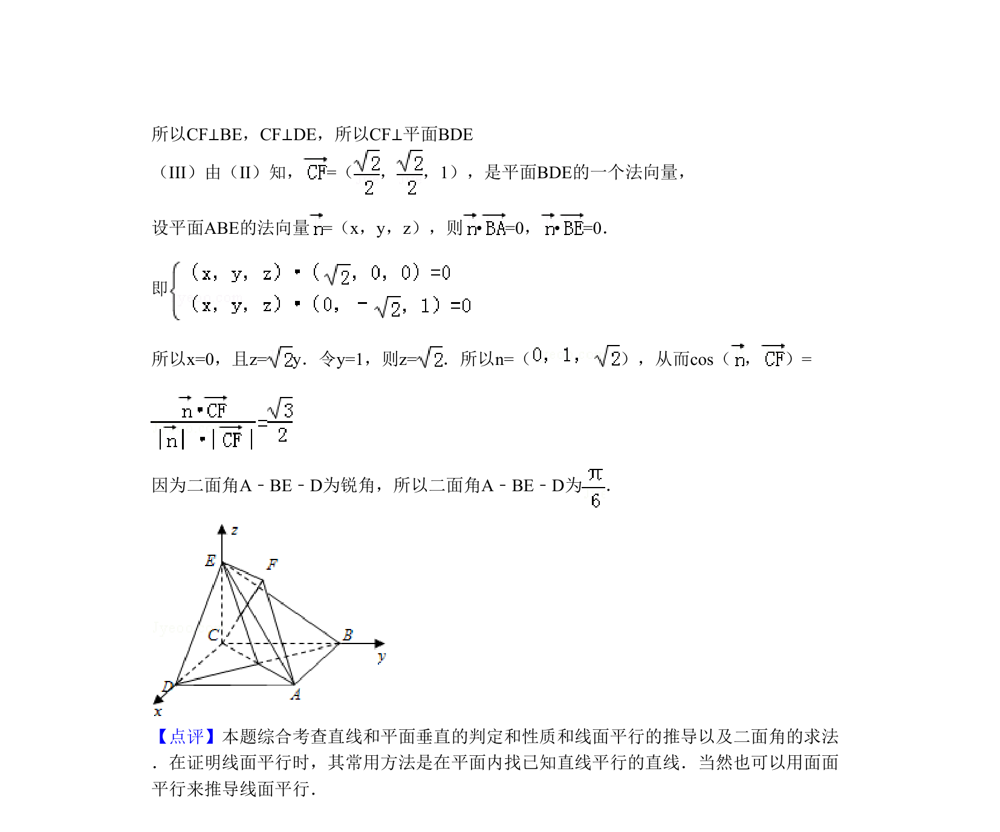

## 题面

## 摘要

考查线面平行与垂直的证明，及利用空间向量求二面角的大小。

## 关联考点

- [[1089-线面平行判定|直线与平面平行的判定]]
- [[1088-线面垂直的判定定理|直线与平面垂直的判定]]
- [[用空间向量求二面角]]

## 答案与解析

> 📄 原 PDF 第 9 页：`素材/真题/北京/2008-2024·（北京）数学高考真题/2010年高考数学试卷（理）（北京）（解析卷）.pdf`
