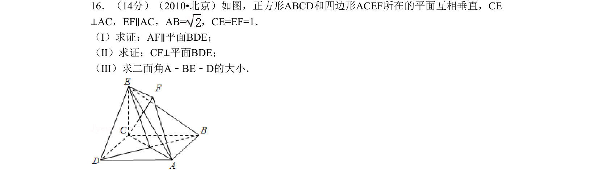
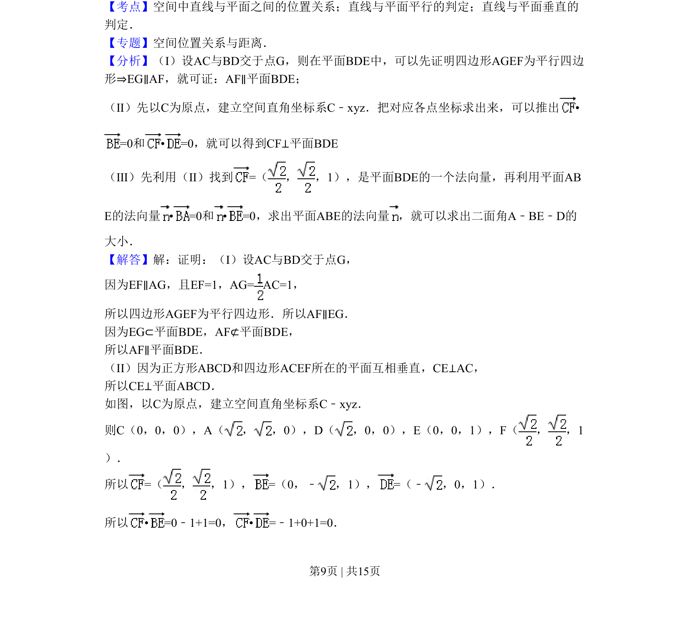
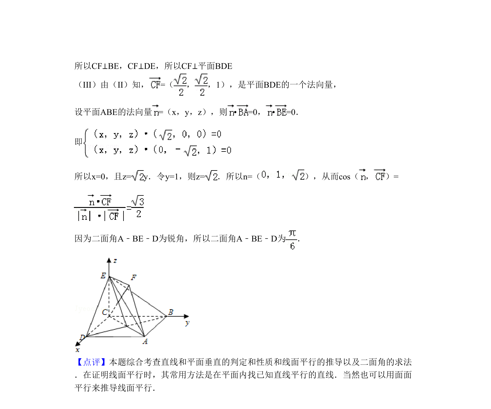

## 题面

## 摘要

考查线面平行与垂直的证明，及利用空间向量求二面角的大小。

## 关联考点

- [[1400-线面平行的判定|直线与平面平行的判定]]
- [[1087-线面垂直的判定定理|直线与平面垂直的判定]]
- [[用空间向量求二面角]]

## 答案与解析

> 📄 原 PDF 第 9 页：`素材/真题/北京/2008-2024·（北京）数学高考真题/2010年高考数学试卷（理）（北京）（解析卷）.pdf`

<!-- 题干文本-start -->
## 题干文本
16．（14分）（2010•北京）如图，正方形ABCD和四边形ACEF所在的平面互相垂直，CE
⊥AC，EF∥AC，AB=，CE=EF=1．
（Ⅰ）求证：AF∥平面BDE；
（Ⅱ）求证：CF⊥平面BDE；
（Ⅲ）求二面角A﹣BE﹣D的大小．
<!-- 题干文本-end -->

<!-- 解析文本-start -->
## 解析文本
【考点】空间中直线与平面之间的位置关系；直线与平面平行的判定；直线与平面垂直的
判定．菁优网版权所有
【专题】空间位置关系与距离．
【分析】（Ⅰ）设AC与BD交于点G，则在平面BDE中，可以先证明四边形AGEF为平行四边
形⇒EG∥AF，就可证：AF∥平面BDE；
（Ⅱ）先以C为原点，建立空间直角坐标系C﹣xyz．把对应各点坐标求出来，可以推出•
=0和• =0，就可以得到CF⊥平面BDE
（Ⅲ）先利用（Ⅱ）找到=（ ， ，1），是平面BDE的一个法向量，再利用平面AB
E的法向量• =0和• =0，求出平面ABE的法向量 ，就可以求出二面角A﹣BE﹣D的
大小．
【解答】解：证明：（I）设AC与BD交于点G，
因为EF∥AG，且EF=1，AG= AC=1，
所以四边形AGEF为平行四边形．所以AF∥EG．
因为EG⊂平面BDE，AF⊄平面BDE，
所以AF∥平面BDE．
（II）因为正方形ABCD和四边形ACEF所在的平面互相垂直，CE⊥AC，
所以CE⊥平面ABCD．
如图，以C为原点，建立空间直角坐标系C﹣xyz．
则C（0，0，0），A（ ， ，0），D（ ，0，0），E（0，0，1），F（ ， ，1
）．
所以=（ ， ，1），=（0，﹣ ，1），=（﹣ ，0，1）．
所以• =0﹣1+1=0，• =﹣1+0+1=0．
<!-- 解析文本-end -->
