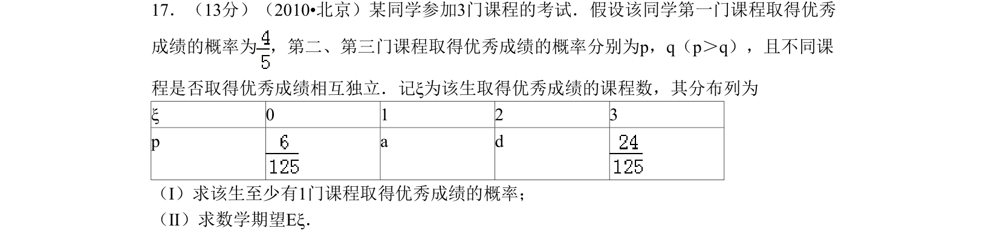
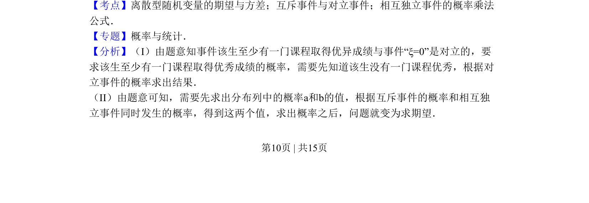
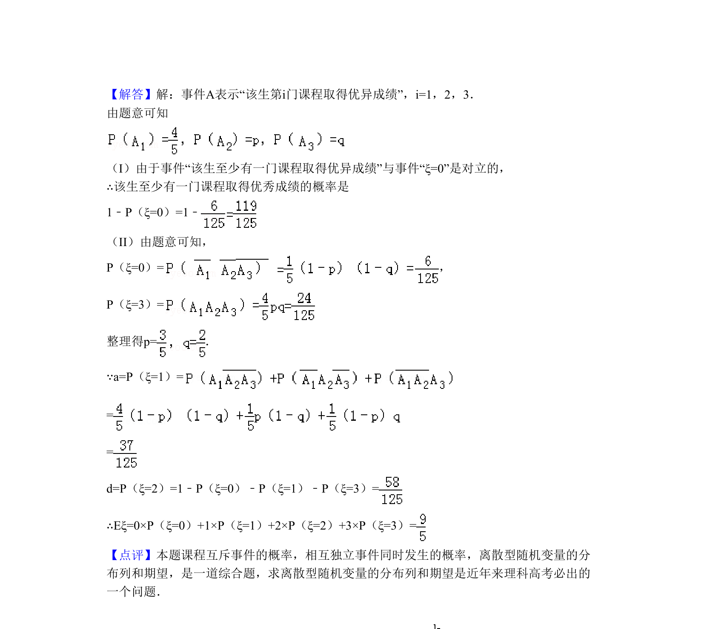

## 题面

## 摘要

已知课程优秀概率及独立条件，通过分布列求对立事件概率和数学期望。

## 关联考点

- [[1331-离散型随机变量的期望与方差|离散型随机变量的期望与方差]]
- [[互斥事件与对立事件]]
- [[相互独立事件的概率乘法公式]]

## 答案与解析

> 📄 原 PDF 第 10 页：`素材/真题/北京/2008-2024·（北京）数学高考真题/2010年高考数学试卷（理）（北京）（解析卷）.pdf`
