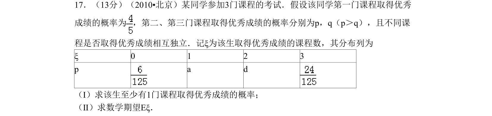
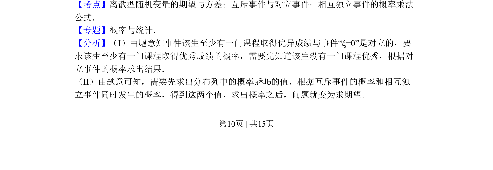
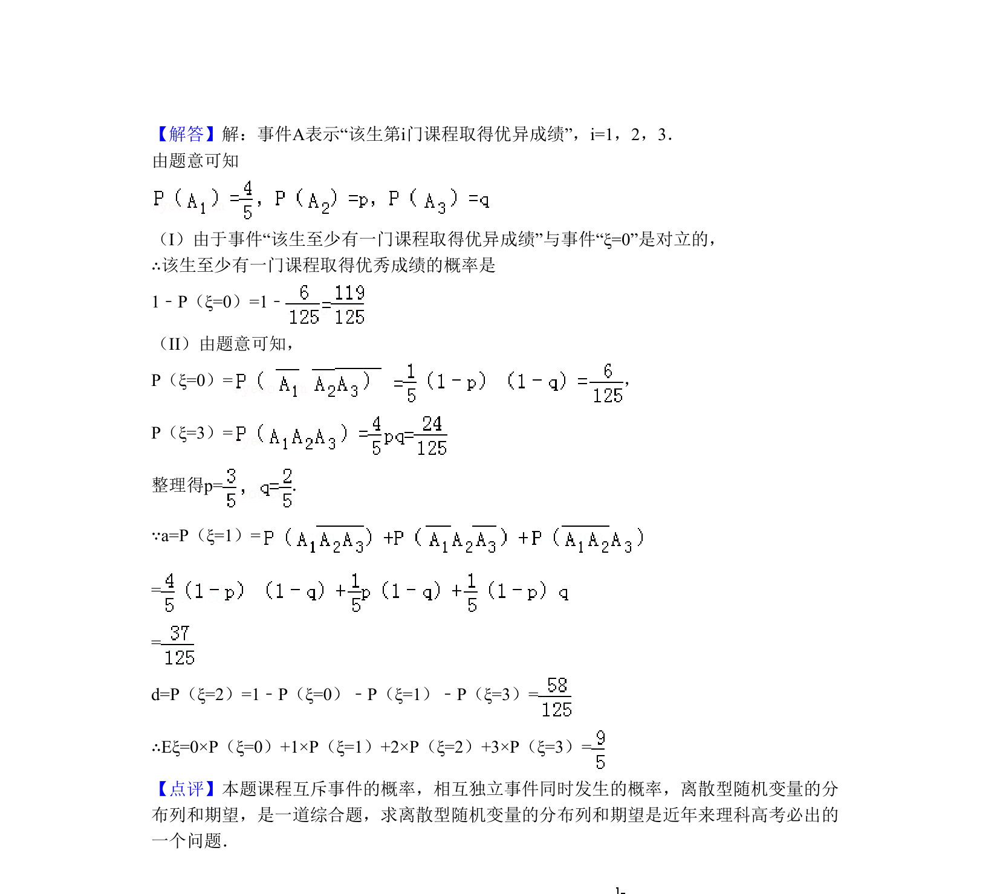

## 题面

## 摘要

已知课程优秀概率及独立条件，通过分布列求对立事件概率和数学期望。

## 关联考点

- [[1331-离散型随机变量的期望与方差|离散型随机变量的期望与方差]]
- [[互斥事件与对立事件]]
- [[相互独立事件的概率乘法公式]]

## 答案与解析

> 📄 原 PDF 第 10 页：`素材/真题/北京/2008-2024·（北京）数学高考真题/2010年高考数学试卷（理）（北京）（解析卷）.pdf`

<!-- 题干文本-start -->
## 题干文本
17．（13分）（2010•北京）某同学参加3门课程的考试．假设该同学第一门课程取得优秀
成绩的概率为 ，第二、第三门课程取得优秀成绩的概率分别为p，q（p＞q），且不同课
程是否取得优秀成绩相互独立．记ξ为该生取得优秀成绩的课程数，其分布列为
ξ 0 1 2 3
p
 a d
（Ⅰ）求该生至少有1门课程取得优秀成绩的概率；
（Ⅱ）求数学期望Eξ．
<!-- 题干文本-end -->

<!-- 解析文本-start -->
## 解析文本
【考点】离散型随机变量的期望与方差；互斥事件与对立事件；相互独立事件的概率乘法
公式．菁优网版权所有
【专题】概率与统计．
【分析】（I）由题意知事件该生至少有一门课程取得优异成绩与事件“ξ=0”是对立的，要
求该生至少有一门课程取得优秀成绩的概率，需要先知道该生没有一门课程优秀，根据对
立事件的概率求出结果．
（II）由题意可知，需要先求出分布列中的概率a和b的值，根据互斥事件的概率和相互独
立事件同时发生的概率，得到这两个值，求出概率之后，问题就变为求期望．
<!-- 解析文本-end -->
