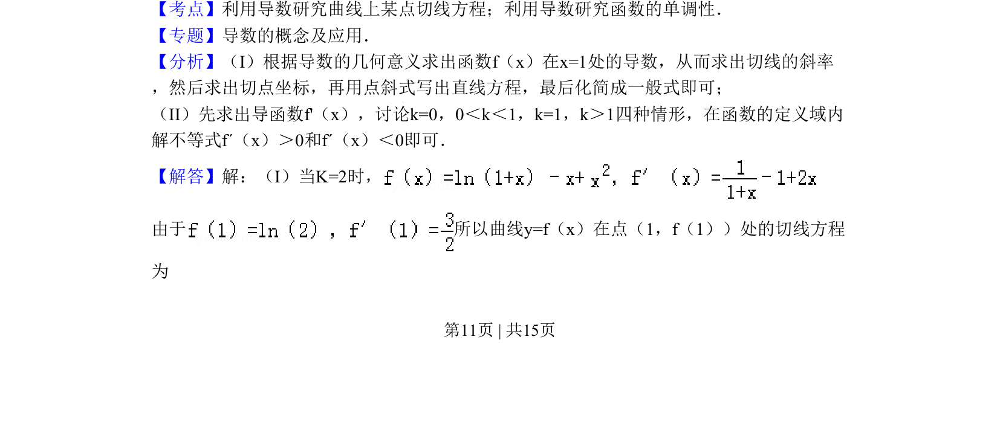
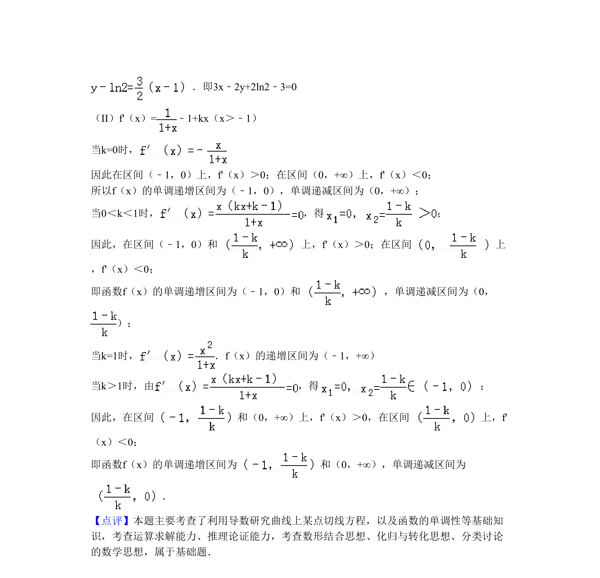

## 题面

## 摘要

已知函数含参数，求特定参数下切线方程及一般情况下的单调区间

## 关联考点

- [[710-利用导数研究曲线上某点切线方程|利用导数研究曲线上某点切线方程]]
- [[705-利用导数研究函数的单调性|利用导数研究函数的单调性]]
- [[含参分类讨论]]

## 答案与解析

> 📄 原 PDF 第 11 页：`素材/真题/北京/2008-2024·（北京）数学高考真题/2010年高考数学试卷（理）（北京）（解析卷）.pdf`
