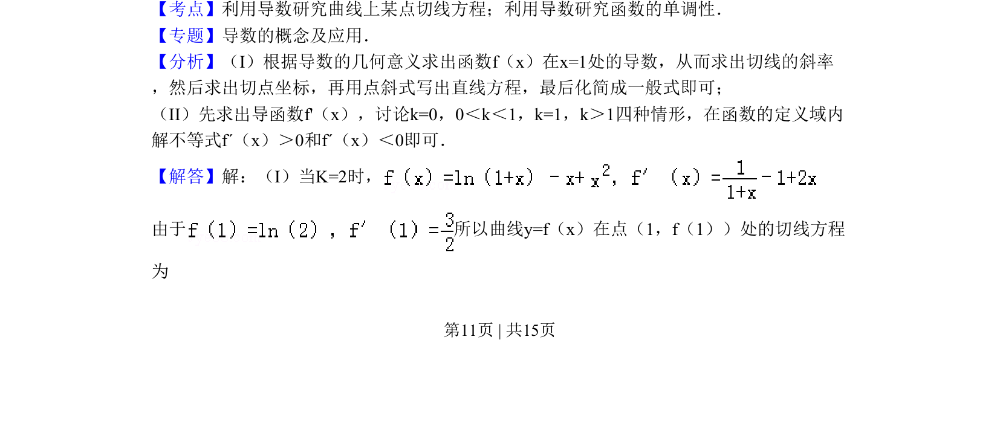
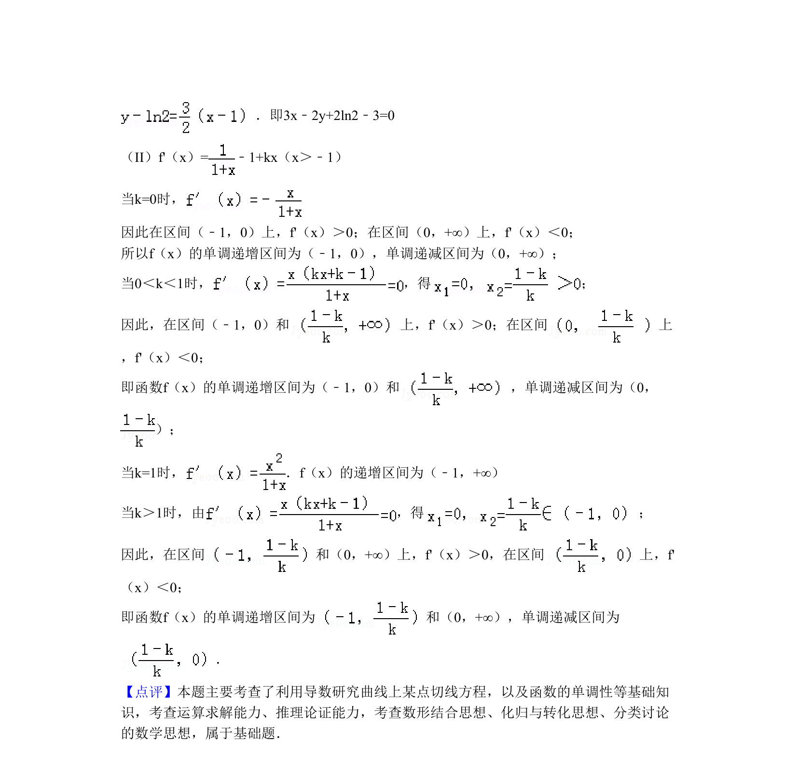

## 题面

## 摘要

已知函数含参数，求特定参数下切线方程及一般情况下的单调区间

## 关联考点

- [[710-利用导数研究曲线上某点切线方程|利用导数研究曲线上某点切线方程]]
- [[705-利用导数研究函数的单调性|利用导数研究函数的单调性]]
- [[含参分类讨论]]

## 答案与解析

> 📄 原 PDF 第 11 页：`素材/真题/北京/2008-2024·（北京）数学高考真题/2010年高考数学试卷（理）（北京）（解析卷）.pdf`

<!-- 题干文本-start -->
## 题干文本
18．（13分）（2010•北京）已知函数f（x）=ln（1+x）﹣x+ x 2（k≥0）．
（Ⅰ）当k=2时，求曲线y=f（x）在点（1，f（1））处的切线方程；
（Ⅱ）求f（x）的单调区间．
<!-- 题干文本-end -->

<!-- 解析文本-start -->
## 解析文本
【考点】利用导数研究曲线上某点切线方程；利用导数研究函数的单调性．菁优网版权所有
【专题】导数的概念及应用．
【分析】（I）根据导数的几何意义求出函数f（x）在x=1处的导数，从而求出切线的斜率
，然后求出切点坐标，再用点斜式写出直线方程，最后化简成一般式即可；
（II）先求出导函数f'（x），讨论k=0，0＜k＜1，k=1，k＞1四种情形，在函数的定义域内
解不等式fˊ（x）＞0和fˊ（x）＜0即可．
【解答】解：（I）当K=2时，
由于 所以曲线y=f（x）在点（1，f（1））处的切线方程
为
<!-- 解析文本-end -->
