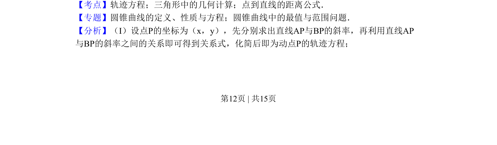
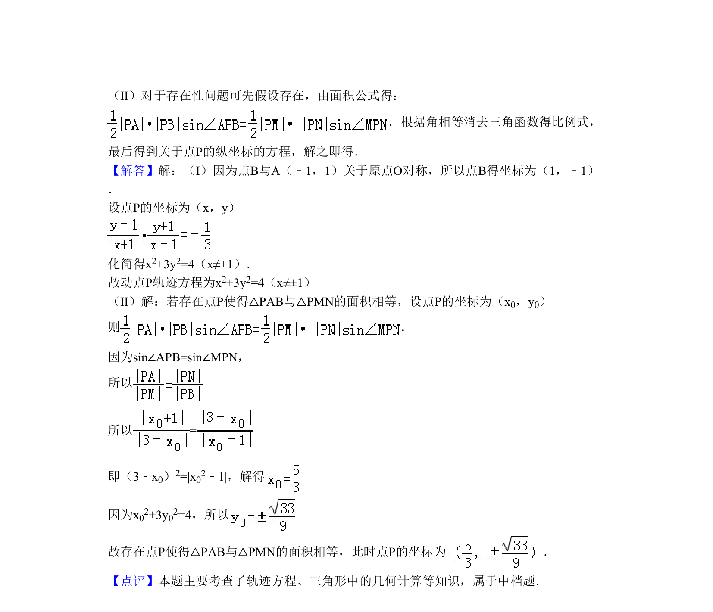

## 题面

## 摘要

已知对称点与斜率之积求动点轨迹，探究满足两三角形面积相等的点P存在性。

## 关联考点

- [[376-圆锥曲线轨迹问题|轨迹方程]]
- [[062-多边形面积|三角形面积]]
- [[981-点到直线的距离|点到直线的距离]]
- [[428-存在性问题|存在性问题]]

## 答案与解析

> 📄 原 PDF 第 12 页：`素材/真题/北京/2008-2024·（北京）数学高考真题/2010年高考数学试卷（理）（北京）（解析卷）.pdf`
