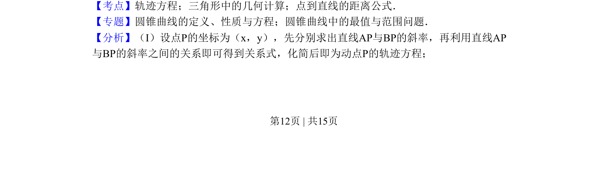
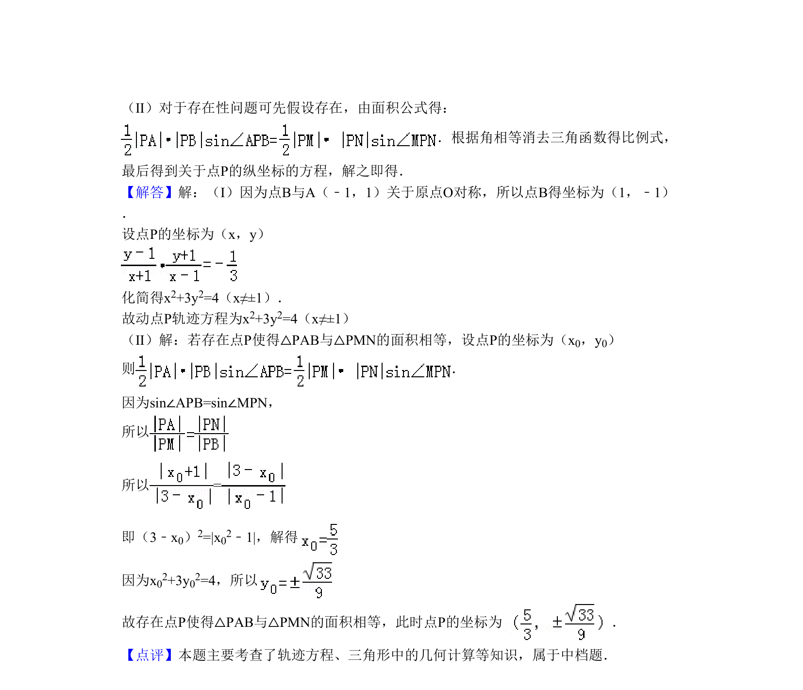

## 题面

## 摘要

已知对称点与斜率之积求动点轨迹，探究满足两三角形面积相等的点P存在性。

## 关联考点

- [[376-圆锥曲线轨迹问题|轨迹方程]]
- [[062-多边形面积|三角形面积]]
- [[1211-点到直线距离|点到直线的距离]]
- [[428-存在性问题|存在性问题]]

## 答案与解析

> 📄 原 PDF 第 12 页：`素材/真题/北京/2008-2024·（北京）数学高考真题/2010年高考数学试卷（理）（北京）（解析卷）.pdf`

<!-- 题干文本-start -->
## 题干文本
19．（14分）（2010•北京）在平面直角坐标系xOy中，点B与点A（﹣1，1）关于原点O对
称，P是动点，且直线AP与BP的斜率之积等于﹣ ．
（Ⅰ）求动点P的轨迹方程；
（Ⅱ）设直线AP和BP分别与直线x=3交于点M，N，问：是否存在点P使得△PAB与△PMN
的面积相等？若存在，求出点P的坐标；若不存在，说明理由．
<!-- 题干文本-end -->

<!-- 解析文本-start -->
## 解析文本
【考点】轨迹方程；三角形中的几何计算；点到直线的距离公式．菁优网版权所有
【专题】圆锥曲线的定义、性质与方程；圆锥曲线中的最值与范围问题．
【分析】（Ⅰ）设点P的坐标为（x，y），先分别求出直线AP与BP的斜率，再利用直线AP
与BP的斜率之间的关系即可得到关系式，化简后即为动点P的轨迹方程；
<!-- 解析文本-end -->
