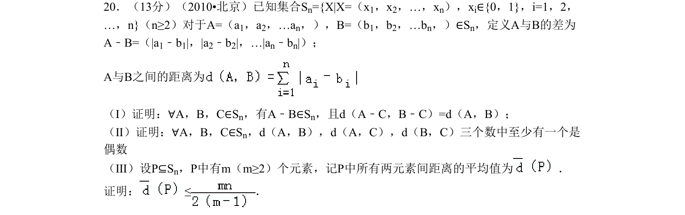
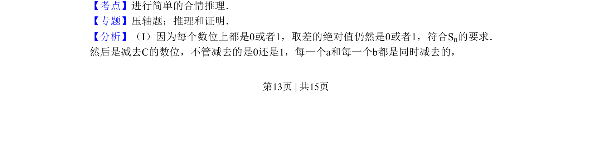
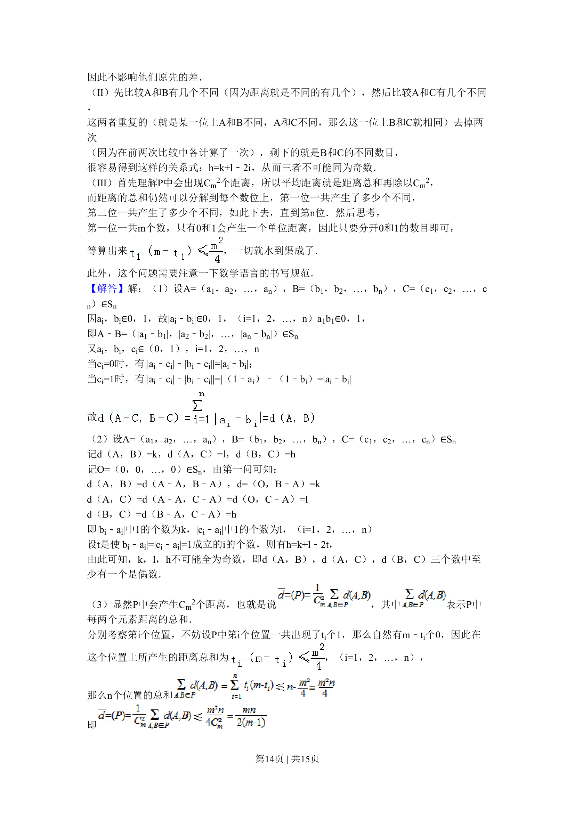
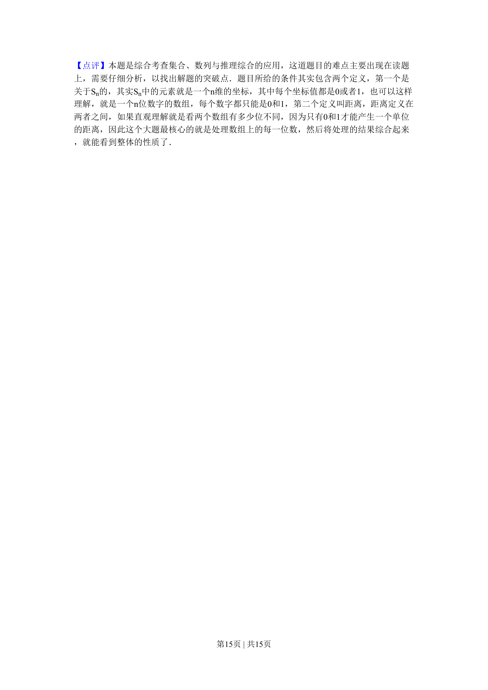

## 题面

## 摘要

该题考查基于0-1序列定义的集合Sn的差和距离运算，证明相关性质并估计子集平均距离的上界。

## 关联考点

- [[740-合情推理|合情推理]]
- [[距离公理]]
- [[1377-奇偶性分析|奇偶性分析]]
- [[平均值估计]]

## 答案与解析

> 📄 原 PDF 第 13 页：`素材/真题/北京/2008-2024·（北京）数学高考真题/2010年高考数学试卷（理）（北京）（解析卷）.pdf`
